# Upravljanje poslovnim procesima (UPP)

**Nositelj**: izv. prof. dr. sc. Darko Etinger  
**Asistent**: Luka Blašković, mag. inf.

**Ustanova**: Sveučilište Jurja Dobrile u Puli, Fakultet informatike u Puli

</img>

# (4) Smjernice u modeliranju i predlošci tokova rada

</img>

 

 
Cilj ove skripte pružiti je sveobuhvatan pregled principa i smjernica u modeliranju poslovnih procesa kroz BPMN 2.0 notaciju. Do sad ste naučili osnovnu BPMN notaciju, uključujući osnovne elemente, tokove i događaje. Međutim, osim poznavanja elemenata (sintakse) važno je poslovni proces modelirati na način koji je razumljiv, konzistentan svim dionicima, ali i treba biti precizan s reprezentacijom stvarnog poslovnog procesa. U ovoj skripti ćemo se fokusirati na izvršivost procesa, pravilno imenovanje i upotrebu međudogađaja, modeliranje komunikacije te predloške tokova rada te smjernice za što bolje modeliranje i teorijsko razumijevanje poslovnih procesa u kontekstu BPMN notacije.

 

**🆙 Posljednje ažurirano: 2.1.2025.**

## Sadržaj

- [Upravljanje poslovnim procesima (UPP)](#upravljanje-poslovnim-procesima-upp)
- [(4) Smjernice u modeliranju i predlošci tokova rada](#4-smjernice-u-modeliranju-i-predlošci-tokova-rada)
  - [Sadržaj](#sadržaj)
- [1. Smjernice za modeliranje procesa](#1-smjernice-za-modeliranje-procesa)
  - [1.1 Aktivnosti vs Događaji](#11-aktivnosti-vs-događaji)
  - [1.2 Koji međudogađaj odabrati?](#12-koji-međudogađaj-odabrati)
  - [1.3 Česte greške u modeliranju komunikacije između procesa](#13-česte-greške-u-modeliranju-komunikacije-između-procesa)
  - [1.4 Nekoliko korisnih smjernica](#14-nekoliko-korisnih-smjernica)
  - [1.5 Entiteti na Message flow](#15-entiteti-na-message-flow)
- [2. Predlošci tokova rada](#2-predlošci-tokova-rada)
    - [Sličnost na razini poslovne domene (makrorazina)](#sličnost-na-razini-poslovne-domene-makrorazina)
    - [Sličnost na razini aktivnosti koje čine proces (mikrorazina)](#sličnost-na-razini-aktivnosti-koje-čine-proces-mikrorazina)
  - [2.1 Osnovni predlošci za upravljanje slijedom](#21-osnovni-predlošci-za-upravljanje-slijedom)
    - [WCP-1 Slijed (eng. Sequence)](#wcp-1-slijed-eng-sequence)
    - [WCP-2 Paralelno dijeljenje (eng. Parallel Split)](#wcp-2-paralelno-dijeljenje-eng-parallel-split)
    - [WCP-3 Sinkronizacija (eng. Synchronization)](#wcp-3-sinkronizacija-eng-synchronization)
    - [WCP-4 Ekskluzivni izbor (eng. Exclusive Choice)](#wcp-4-ekskluzivni-izbor-eng-exclusive-choice)
    - [WCP-5 Jednostavno spajanje (eng. Simple Merge)](#wcp-5-jednostavno-spajanje-eng-simple-merge)
  - [2.2 Predlošci za grananje, sinkronizaciju i iteraciju](#22-predlošci-za-grananje-sinkronizaciju-i-iteraciju)
    - [WCP-6 Višestruki izbor (eng. Multiple Choice)](#wcp-6-višestruki-izbor-eng-multiple-choice)
    - [WCP-7 Strukturno sinkronizirano spajanje (eng. Structured Synchronizing Merge)](#wcp-7-strukturno-sinkronizirano-spajanje-eng-structured-synchronizing-merge)
    - [WCP-8 Nesimetrično sinkronizirano spajanje (eng. Acyclic Synchronizing Merge)](#wcp-8-nesimetrično-sinkronizirano-spajanje-eng-acyclic-synchronizing-merge)
    - [WCP-9 Proizvoljno ponavljanje (eng. Arbitrary Cycles)](#wcp-9-proizvoljno-ponavljanje-eng-arbitrary-cycles)
  - [2.3 Predlošci za okidače](#23-predlošci-za-okidače)
    - [WCP-10 Prolazni okidač (eng. Transient Trigger)](#wcp-10-prolazni-okidač-eng-transient-trigger)
    - [WCP-11 Stalni okidač (eng. Persistent Trigger)](#wcp-11-stalni-okidač-eng-persistent-trigger)

# 1. Smjernice za modeliranje procesa

Do sad ste naučili da postoje 3 glavna objekata toka u BPMN notaciji, to su:

1. **Događaji** (_eng. Events_)
2. **Aktivnosti** (_eng. Activities_)
3. **Skretnice** (_eng. Gateways_)

Premda su razlike između ovih objekata jasne, ponekad je teško odrediti koji objekt koristiti u određenom trenutku.

Rekli smo da:

- `Događaji` označavaju određene trenutke u procesu koji označavaju promjenu stanja, poput početka (_start event_), završetka (_end event_) ili ključnih točaka između (_intermediate event_). Oni su **pasivni elementi** i ne **podrazumijevaju akciju**, već **signaliziraju** da se određeni uvjet ispunio ili stanje promijenilo
- `Aktivnosti` predstavljaju zadatke ili skup radnji koje se trebaju izvršiti kako bi proces "napredovao". Rekli smo da su za izvođenje aktivnosti potrebni neki **resursi** i **vrijeme**. Radi se o **operativnim elementima procesa**.
- `Skretnice` omogućuju donošenje odluka unutar procesa, usmjeravajući tijek rada prema različitim pravcima na temelju definiranih uvjeta. Smjernice su ključne za **razgranavanje** i **kontrolu toka procesa**.

## 1.1 Aktivnosti vs Događaji

Iako su definicije aktivnosti i događaja poprilično jasne, ponekad možemo biti u nedoumici koji što odabrati. Najbolje je razmišljati o tome kako se događaji i aktivnosti razlikuju u kontekstu procesa.

Primjerice, ako se pitate _"Što se događa u procesu?"_, tada je vjerojatno da je riječ o aktivnosti. S druge strane, ako se pitate _"Kada se nešto događa ili se dogodilo u procesu?"_, tada je vjerojatno da je riječ o događaju.

Za primjer uzmimo proces NARUČIVANJE PROIZVODA, tada bi se **aktivnosti** mogle odnositi na:

- "Unos podataka o kupcu",
- "Unos podataka o proizvodu",
- "Plaćanje",
- "Pakiranje",
- "Dostava"

Dok bi se **događaji** mogli odnositi na:

- "Primljen zahtjev za narudžbu",
- "Proizvod poslan kupcu",
- "Plaćanje primljeno"

**Kako ispravno imenovati `Aktivnost`**:

- **Glagolska imenica** koja opisuje radnju, npr. "Unos", "Plaćanje", "Pakiranje", "Dostava"
- Naglašen **objekt** na kojeg se aktivnost odnosi, npr. "Unos podataka", "Pakiranje proizvoda", "Pakiranje robe", "Dostava paketa"
- Može biti i **glagol u infinitivu**, npr. "Obavijestiti kupca", "Poslati proizvod", "Pripremiti račun"
- **Nije uobičajeno navoditi subjekt**, budući da je subjekt implicitno jasan iz konteksta modela (polje/staze), npr. "Kupac unosi podatke", "Dostavljač dostavlja paket"
- Poželjno je koristiti infinitiv, glagolsku imenicu ili iznimno glagol u 3. licu (nikako u 1. i 2. licu)
- Uobičajeno je koristiti **aktivni glagolski oblik**

**Kako ispravno imenovati `Događaj`**:

- **Glagolska imenica** koja opisuje **prošlo** (završeno) stanje, npr. "Primljena narudžba", "Plaćanje primljeno", "Proizvod poslan", "Pristigla narudžba"
- **Poželjno je** da sadržava informacije o subjektu i objektu, npr. "Kupac poslao narudžbu", "Dostavljač preuzeo paket", "Proizvod poslan kupcu", "Pristigao email od klijenta"
- Ako se radi o _timer eventu_, tada se koristi **vremenska oznaka**, npr. "Nakon 3 dana", "Svaki ponedjeljak", "Svaki mjesec", "Prošlo 5 minuta" itd.
- Radnja ne smije biti **u infinitivu** (kao kod aktivnosti), već se radi o **završenoj radnji** koja se dogodila u prošlosti, npr. "Proizvod poslan", "Plaćanje primljeno", "Narudžba zaprimljena"
- **Međudogađaje** je moguće imenovati i u **futuru** (budućnosti), npr. "Po primitku zahtjeva", "Kada stigne odgovor", "Jednom kad se dogodi..."
- **Nije uobičajeno koristiti infinitiv**
- **Uobičajeno je koristiti pasivan glagolski oblik**

> Važno je dobro naučiti i držati se ovih smjernica imenovanja budući da će vam to olakšati odabir ispravnog elementa prilikom modeliranja procesa.

_Primjer: Obrada pristigle narudžbe i upis narudžbe u ERP sustav_

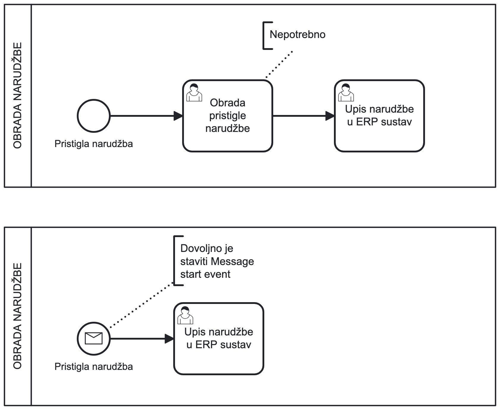</img>

> Primjer neispravno modeliranog (iznad) i ispravno modeliranog (ispod) procesa

"Pristigla narudžba" prikazujemo kao `Start Event` jer se radi o završenoj radnji koja se dogodila u prošlosti. S druge strane, "Upis narudžbe u ERP sustav" prikazujemo kao `User Task` jer se radi o radnji koju je potrebno poduzeti kako bi proces "napredovao".

"Obrada pristigle narudžbe" u ovom kontekstu korisničkog zadatka nema puno smisla, jer iz opisa aktivnosti nije jasno što se ovom radnjom postiže. Prisjetite se da korisničke aktivnosti (zadaci) trebaju biti jasno i precizno definirani, a u kontekstu procesne aplikacije oni će biti **operativne radnje** gdje korisnik unosi podatke, odabire opcije i sl. kroz sučelje **web forme**.

_Primjer: Proces postprodajne usluge koji započinje jednom kad je roba otpremljena kupcu_

</img>

> Primjer dvaju modeliranih procesa u zasebnim poljima

U ovom procesu "Roba otpremljena kupcu" prikazujemo kao `End Event` jer se radi o završenom događaju, koji se dogodio kao rezultat procesa otpreme. Proces POSTPRODAJNA OBRADA započinje jednom kad je roba otpremljena kupcu, a završava kad je postprodajna usluga pružena. Ovakvim imenovanjem procesa nema smisla proces POSTPRODAJNE USLUGE ugnijezditi kao potproces unutar procesa OTPREMA ROBE jer se radi o dvjema različitim procesima, odnosno proces postprodaje započinje tek kad je roba otpremljena kupcu.

Isto bi bilo moguće kada bi modelirali proces OBRADA NARUDŽBE koji bi "razbili" na potprocese OTPREMA ROBE i POSTPRODAJNA OBRADA.

## 1.2 Koji međudogađaj odabrati?

**Međudogađaji** (_eng. Intermediate Events_) koriste se za označavanje **ključnih točaka (događaja) između početka i kraja procesa**. Preciznije, koriste se za modeliranje ključnih trenutaka u procesu koji **ne predstavljaju početak ili kraj procesa**, ali svakako mogu promijeniti tijek izvođenja.

**Međudogađaji** se koriste za:

  
  Označavanje <b>ključnih točaka</b> u procesu, tzv. <b>Milestone</b> (<code>Intermediate throw event</code>)

- ✅ Primjeri **ispravnog** imenovanja: "Tijesto se dignulo", "Vrijeme isteklo", "Paket spreman za slanje", "Hrana spremna", "Vremenska prognoza prikladna", "Proizvod na zalihi"...

- ❌ Primjeri **neispravnog** imenovanja: "Spremanje tijesta", "Priprema paketa", "Pakiranje robe", "Pohrana bilješki"...

  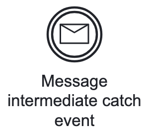
  Definiranje <b>nespecificiranog čekanja</b> u procesu, odnosno <b>čekanje na primitak vanjskog signala</b> (<code>Message Intermediate Catch event</code>)

- ✅ Primjeri **ispravnog** imenovanja: "Primljen signal", "Primljena odbijenica", "Jednom kad pristigne odgovor", "Jednom kad je gotov", "Pristigao email potvrde", "Kada pristigne poruka klijenta", "Čekanje na primitak obavijesti o...", "Po primitku zahtjeva"...

- ❌ Primjeri **neispravnog** imenovanja: "Slanje odgovora korisniku", "Klijent provjerava email...", "Djelatnik obavještava..."

  
  Označavanje kraja <b>specificiranog čekanja</b> u procesu, ili <b>početak određenog vremenskog razdoblja</b> (<code>Timer Intermediate Catch event</code>)

- ✅ Primjeri **ispravnog** imenovanja: "Nakon 3 dana", "Svaki ponedjeljak", "Svaki mjesec", "Prošlo 5 minuta", "Stigao ponedjeljak", "Prošlo je 2 tjedna", "90 minuta", "4 sata", "Pristizanje na red u koloni", "Narudžba došla na red za obradu nakon X vremena"
- ❌ Primjeri **neispravnog** imenovanja: "Čekaj timer", "Čekanje na odgovor", "Čekanje na primitak poruke", "Čekaj", "Timer"

  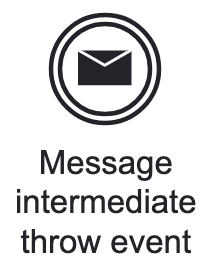
  Za <b>signalizaciju drugih aktora</b> u procesu, ili <b>okidanje drugih procesa</b> (<code>Message Intermediate throw event</code>)

- ✅ Primjeri **ispravnog** imenovanja: "Proces X signaliziran", "Klijent obaviješten", "SMS poslan", "Poslan email kupcu", "Inicijaliziran proces narudžbe", "Račun dostavljen klijentu" itd.
- ❌ Primjeri **neispravnog** imenovanje: "Pošalji email", "Slanje računa kupcu", "Obavijesti klijenta", "Pošalji SMS djelatniku"

> **Zaključno**: Međudogađaje nastojite imenovati na način da jasno i precizno opisuju **trenutak** ili **stanje** u procesu koji se dogodio ili koji će se dogoditi (koji se očekuje). Koristite pasivan ton, izbjegavajte infinitiv te koristite pasivan glagolski oblik. **Izbjegavajte nazivati ove događaje kao radnje** (**aktivnosti**)

_Primjer: Klijent naručuje hranu iz restorana putem nekog medija, a potom čeka na dovršetak. Međutim, ako prođe preko sat vremena, klijent odustaje od narudžbe._

</img>

> Primjer modeliranog procesa u jednom polju s dvije staze

U ovom primjeru, koristi se **paralelna skretnica (AND)** te se proces dalje razlaže na način: "ono što se prije dogodi".

- ili će se narudžba dovršiti u roku od 1 sata i klijent će ju preuzeti
- ili će proći sat vremena i klijent odustaje

**Kako znamo unaprijed vremensko razdoblje**, možemo iskoristiti `Timer Intermediate Catch Event` za čekanje tih sat vremena ako se narudžba ne dovrši.

"Priprema hrane" je prikazana sklopljenim potprocesom (_eng. collapsed subprocess_) koji traje neko vrijeme, a jednom kad je hrana spremna, ovisno o kontekstu, možemo definirati _milestone_ (ključnu točku) "Hrana spremna" ili "Hrana gotova!" kao `Intermediate Throw Event`. Međutim, u ovom slučaju je moguće istu stvar prikazati i `Timer Intermediate Catch event` budući da se radi o vremenskom razdoblju potrebnom za pripremu hrane gdje nam je procijenjeno vrijeme pripreme hrane unaprijed poznato.

Međutim, _milestone_ i ne mora biti nužno vezan uz vremensko razdoblje, već može označavati **ključnu točku u procesu**, npr. "Vremenska prognoza prikladna" → Okini neki drugi proces ili nastavi slijed aktivnosti.

Vanjske procese moguće je okinuti pomoću `Send Task` aktivnosti, međutim ono se preciznije koristi za slanje poruka vanjskim dionicima (npr. email, SMS i sl.). Ukoliko želimo okinuti drugi proces, prikladnije je koristiti `Message Intermediate Throw Event`.

**Komunikaciju između događaja** prikazujemo kroz `Message Flow`, koji predstavlja samo **vezu informativnog karaktera** (ne utječe na sekvencijalni tijek procesa već samo pruža informaciju o komunikaciji između dva objekta).

</img>

> Primjer modeliranog procesa u dva polja

U primjeru iznad, prikladno je koristiti `Send Task` aktivnost za signalizaciju međudogađaja "Primanje obavijesti o završetku pripreme" budući da se radi o slanju nekog oblika poruke. Da to nije slučaj, prikladnije bi bilo koristiti `Intermediate Throw Event` te definirati _milestone_, npr. "Hrana spremna".

## 1.3 Česte greške u modeliranju komunikacije između procesa

U BPMN modelima često moramo modelirati **komunikaciju između različitih procesa** (npr. jedan proces pokreće/okida drugi) ili inter-procesnu komunikaciju gdje se informacije razmjenjuju **između različitih staza**.

Jedna od najčešćih grešaka u modeliranju procesa odnosi se upravo na neispravno modeliranje komunikacije i sekvencijalnog tijeka.

Prisjetimo se elemenata koji se koriste za komunikaciju:

- `Message Flow` - **veza** između dva objekta koja označava komunikaciju između njih (informativnog karaktera)
- `Sequence Flow` - **veza** između dva objekta koja označava sekvencijalni tijek procesa (utječe na egzekuciju procesa)
- `Message Intermediate Throw Event` - **međudogađaj** koji signalizira drugom procesu da nešto učini
- `Message Intermediate Catch Event` - **međudogađaj** koji čeka na signalizaciju od drugog procesa
- `Send Task` - **aktivnost** koja šalje poruku (e-mail, SMS, itd.) vanjskom dioniku (može pokretati druge procese)
- `Receive Task` - **aktivnost** koja čeka na primitak poruke (e-mail, SMS, itd.) od vanjskog dionika kako bi sekvencijalni tijek nastavio

Komunikaciju ćemo nastojati objasniti na primjeru **Veleprodaje** i **Skladišta** na procesima naručivanja i otpreme robe:

**Veleprodaju** predstavljamo kao zasebni proces u zasebnom polju (VELEPRODAJA - PROCES NARUČIVANJA ROBE). Proces započinje kad veleprodaja zaprimi narudžbu. Evidencijom zaliha zaključuju da nedostaje robe pa moraju kontaktirati skladište kako bi provjerili dostupnosti i naručili što nedostaje.

**Skladište** u ovom kontekstu je _outsourcani_ partner čiji ćemo proces nazvati OTPREMA ROBE.

</img>

> Primjer modeliranih procesa s **pogrešnom komunikacijom između 2 polja/procesa**

Idemo identificirati što je dobro, a što pogrešno u ovom modelu.

- ✅ **Dobar dio**: Budući da se radi o slanju poruke skladištu koristimo `Send Task` aktivnost za slanje poruke o nedostatku robe na zalihama u veleprodajnom skladištu
- ❌ **Pogreška**: Međutim, SKLADIŠTE - OTPREMA ROBE je proces za sebe, definiran u vlastitom polju, a nema početni događaj. Svaki proces (definiran u vlastitom polju) ili potproces mora imati `Start Event`.

Kako ispraviti ovu pogrešku? Jednostavno ćemo dodati početni događaj u polje **Skladište - Otprema robe**.

</img>

> Primjer modeliranih procesa s **ispravljenom komunikacijom između 2 polja/procesa**

Međutim, što ako se radi o internom skladištu koje je dio iste veleprodaje? U tom slučaju komunikaciju **ne želimo modelirati kao slanje poruke** (prisjetimo se emaila, SMS-a i sl.) Dakle, možemo maknuti `Send Task` aktivnost i samo nastaviti `Sequence Flow`.

</img>

> Primjer modeliranog procesa VELEPRODAJA - PROCES NARUČIVANJA ROBE **pogrešnom komunikacijom unutar istog polja**

- ✅ **Dobar dio**: Budući da se radi o internom skladištu, uklanjamo `Timer Intermediate Catch event` "Svaki ponedjeljak", već na sekvencijalni slijed između pripreme robe i XOR Mergea možemo ubaciti _milestone_ "Roba spremna", iako je to više opcionalno, bolje pojašnjava tijek procesa i **naglašava da je postojalo neko vremensko razdoblje** za pripremu robe.
- ❌ **Pogreška**: Radi se o internom skladištu, ne modeliramo "slanje maila, SMS-a ili sl. poruke" već samo "provjeravamo" dostupnost robe u tom skladištu putem istog IT sustava, ERP-a ili sl.

Možemo jednostavno ukloniti `Send Task` aktivnost i samo nastaviti `Sequence Flow`

</img>

> Primjer modeliranog procesa VELEPRODAJA - PROCES NARUČIVANJA ROBE s **ispravnom komunikacijom unutar istog polja**

Razmotrimo ponovno scenarij s eksternim skladištem. Što se događa ako se, nakon dolaska šlepera s robom, pojavi potreba za dodatnom narudžbom robe?

- Primjer situacije: maloprodaja je zatražila dodatne artikle koji nisu bili uključeni u prvobitnu narudžbu međutim instanca procesa SKLADIŠTE - OTPREMA ROBE je već završena dok proces VELEPRODAJA - PROCES NARUČIVANJA ROBE **čeka na međudogađaju dok ne stigne ponedjeljak, samim tim i šleper**.

Kako bismo cijeli proces učinili jasnijim i preglednijim, možemo ga modelirati **korištenjem međudogađaja** `Message Intermediate Throw Event` i `Message Intermediate Catch Event`:

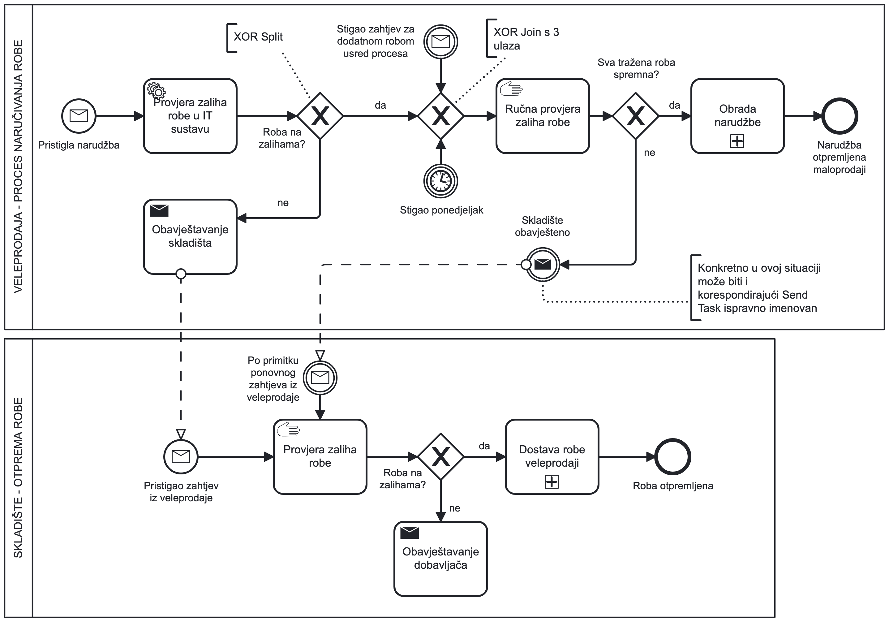</img>

> Primjer modeliranog procesa s ponovnim pokretanjem procesa 'Otprema robe' u skladištu

- ✅ **Ispravno**: U ovom slučaju, koristimo `Message Intermediate Throw Event` za signalizaciju potrebe za dodatnom narudžbom robe. Kada se dogodi taj međudogađaj, ponovno se stvara instanca procesa VELEPRODAJA - PROCES NARUČIVANJA ROBE. Koristimo korespondirajući `Message Intermediate Catch Event` za hvatanje tog signala i pokretanje procesa SKLADIŠTE - OTPREMA ROBE.
- ✅ **Ispravno**: Definirali smo i `Message Intermediate Catch Event` "Stigao zahtjev za dodatnom robom usred procesa" kako bi jasno definirali trenutak kad se za vrijeme trajanja procesa VELEPRODAJA - PROCES NARUČIVANJA ROBE pojavila potreba za dodatnom narudžbom robe. Potreba se pojavila usred procesa, dok se čeka na dolazak šlepera s prvotnom narudžbom.

Ono što vas može buniti je razlika između `Message Intermediate Throw Event` i `Send Task` aktivnosti. Radi se o vrlo sličnim objektima (bez obzira što je jedan događaj, drugi aktivnost). U primjeru iznad, oba se mogu koristiti za slanje poruke vanjskom skladištu s narudžbom. **Razlike su sljedeće:**

- `Send Task` - koristi se za **slanje poruke dioniku procesa** (npr. email, SMS, itd.) te **potencijalno okidanje procesa na temelju te poruke** (ipak, češće je to samo slanje poruke)
- `Message Intermediate Throw Event` - koristi se za **signaliziranje drugog procesa** da nešto "učini" (npr. signalizacija u procesu OTPREMA ROBE) ne nužno slanjem poruke, već **okidanje procesa na temelju događaja (_event-based_)**

Ista distinkcija vrijedi i za `Message Intermediate Catch Event` i `Receive Task`.

U oba slučaja potrebno je držati se pravila imenovanja događaja (međudogađaja) i aktivnosti kako bi model ostao konzistentan prema BPMN sintaksi.

## 1.4 Nekoliko korisnih smjernica

1. Koristite `Send Task` za eksplicitno slanje poruka dionicima procesa (npr. email, SMS, itd.)
2. Koristite `Receive Task` za obradu poruka koje dolaze od dionika procesa (`Receive Task` je ustvari ekvivalentna kratica za `Message Intermediate Catch event + Task`)
3. Koristite `Message Intermediate Throw Event` za signalizaciju drugim procesima da nešto učine (okidanje drugih procesa)
4. Koristite `Message Intermediate Catch Event` za hvatanje signala ili poruka od drugih procesa (okidanje procesa na temelju događaja)
5. Koristite `Intermediate Throw Event` za signalizaciju ključnih točaka u procesu (_milestone_)
6. Koristite `Timer Intermediate Catch Event` kada proces stagnira na način da čeka na specificirano vremensko razdoblje

`Receive Task` nismo puno dosad koristili, međutim on je ustvari kratica za `Message Intermediate Catch event` i `Task` koji se koristi za hvatanje poruka od vanjskih dionika. Ukoliko želimo modelirati aktivnost koji čeka na primitak poruke te ju nakon tog izvršavamo, koristimo `Receive Task`.

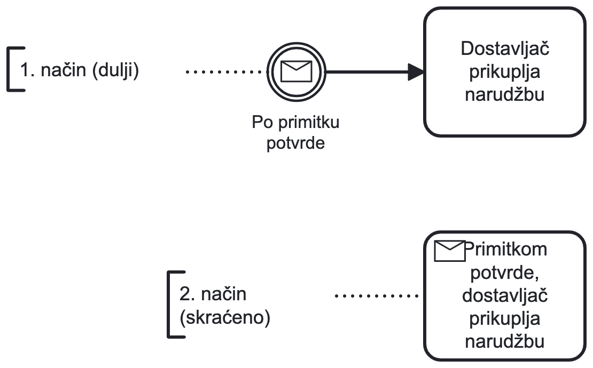</img>

> Sljedeći primjeri su ekvivalentni (Iznad je `Message Intermediate Catch event + Task`, ispod je `Receive Task`)

`Intermediate Throw Event` je korisno koristiti kada želimo naglasiti ključne točke u procesu, tzv. _milestone_ (npr. "Roba spremna", "Vrijeme isteklo", "Proizvod na zalihi", "Hrana spremna"). Bez obzira, procesi tijek je moguće definirati i bez njih, ali na ovaj način možemo značajno **poboljšati čitljivost** i **razumljivost procesa**.

Uzmimo za primjer sljedeći super jednostavan proces pripreme i posluživanja hrane:

</img>

Možemo dodati `Intermediate Throw Event` "Hrana spremna" kako bismo naglasili ključnu točku u procesu. Ovaj događaj ne utječe na sekvencijalni tijek procesa, već samo signalizira da je hrana spremna za posluživanje te na taj način postižemo bolju čitljivost procesa.

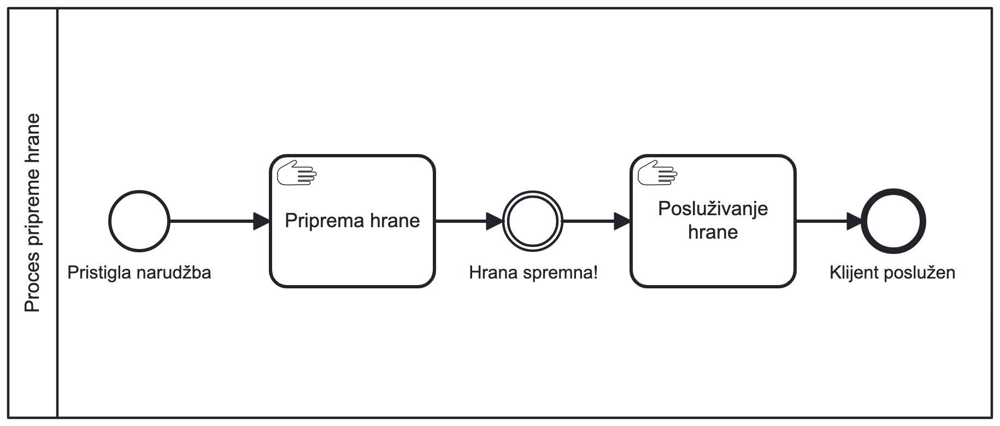</img>

_Primjer: Što ako su naši klijenti djeca na rođendanu? Želimo zabavljati djecu dok čekaju hranu._
Možemo dodati paralelnu aktivnost gdje zabavljamo djecu dok hrana nije gotova, a samo čekanje na spremanje hrane naglasiti kroz `Timer Intermediate Catch Event` "Trajanje pripreme hrane". Po završetku vremenskog razdoblja, proces se nastavlja.

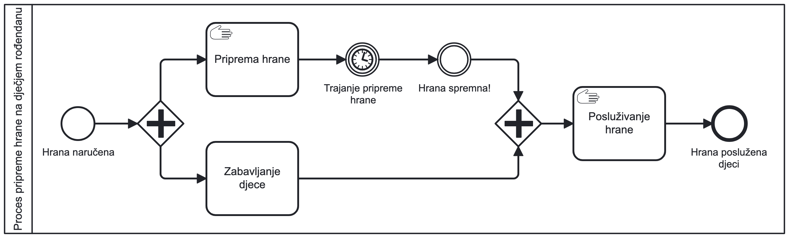</img>

_Primjer:_ Zakomplicirat ćemo još malo stvari. Što ako nam hrana izgori i nemamo više ideja kako zabavljati djecu (primjerice prođe preko 2 sata)? U tom slučaju, ćemo naručiti pizzu iz obližnje pizzerije. Komunikaciju prema pizzeriji možemo prikazati kroz `Send Task` aktivnost koja se izvršava jednom kad se okine `Timer Intermediate Catch Event` - "Djeca izgubila strpljenje nakon 2 sata".

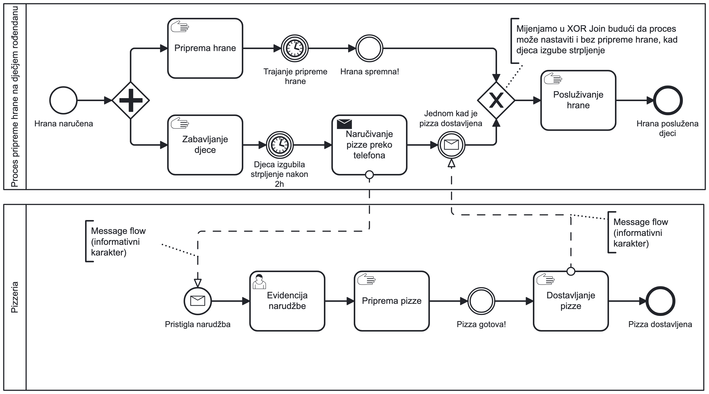</img>

## 1.5 Entiteti na Message flow

Uobičajeno je dodati entitete na `Message Flow` kako bi se dodatno pojasnila komunikacija između objekata. Primjerice, možemo dodati entitet "Narudžba" na `Message Flow` između `Send Task` "Naručivanje pizze preko telefona" i `Message Start Event` "Pristigla narudžba" kako bi naglasili da je poruka koja se šalje upravo **narudžba s detaljima o pizzi**.

Jednako tako možemo na `Message Flow` između `Manual task` "Dostavljanje pizze" i `Message Intermediate Catch Event`: "Jednom kad je pizza dostavljena", dodati entitet "Naručene pizze i račun" kako bi naglasili da se poruka odnosi na **dostavu pizze i račun**.

</img>

**Entiteti** na `Message Flow` su korisni jer:

- **pojašnjavaju** što se šalje između objekata
- **jasno definiraju** što se očekuje od poruke
- **poboljšavaju čitljivost** i **razumljivost** modela

Ilustracija ispod prikazuje komunikaciju između PRODAVATELJA i KUPCA te različite entitete koji se šalju između njih, a koje definiramo na `Message Flow`.

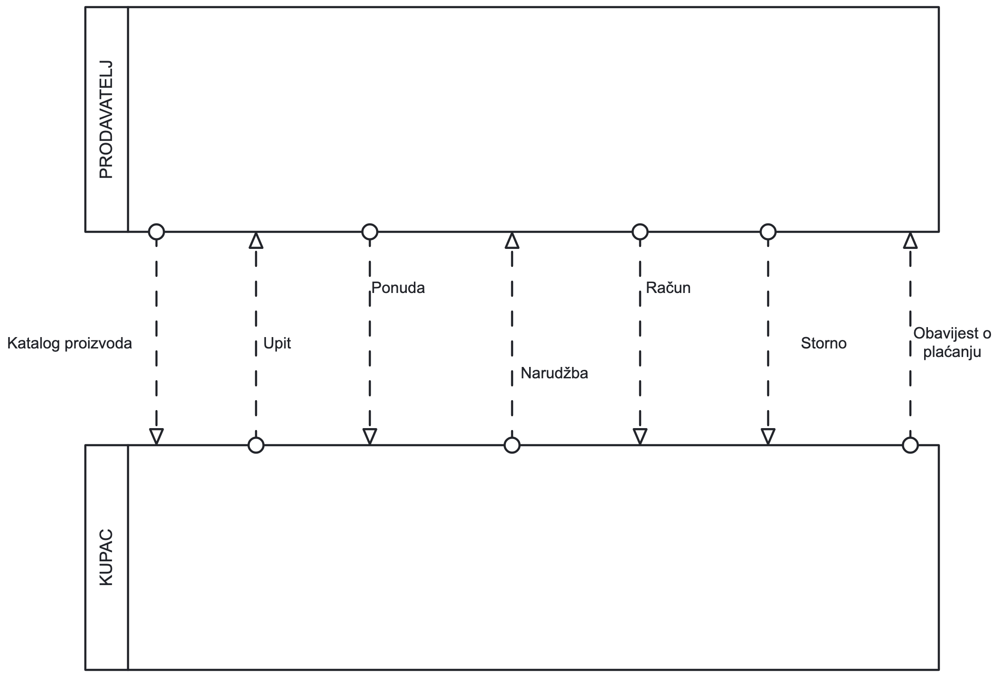</img>

# 2. Predlošci tokova rada

Poslovni procesi s kojima se susrećemo izgledaju nam međusobno vrlo različiti: čini se da svaki od njih ima svoje specifične ciljeve, da se provodi u drugom okruženju i da raspolaže drugim resursima. Premda je to točno, dublja studija ipak otkriva da u logičkoj strukturi modela procesa ima mnogo više sličnosti nego što se to čini u prvom trenutku. Ta se sličnost može utvrditi na dvjema (možemo reći **makro** i **mikro**) razinama.

### Sličnost na razini poslovne domene (makrorazina)

U dosadašnjim primjerima razmatrali smo modele koji bi se mogli primijeniti u više različitih organizacija. Tako se npr. roba široke potrošnje sa svakog veleprodajnog skladišta distribuira prema modelu koji je sličan onom koji smo spomenuli na početku vježbi (narudžba, otprema, dostava). Iako se detalji mogu razlikovati, osnovni tok poslovnog procesa je isti, odnosno aktivnosti se provode prema općoj shemi: PRIHVATITI NARUDŽBU → PROVJERITI MOGUĆNOST ISPORUKE → IZUZETI ROBU SA SKLADIŠTA → OTPREMITI ROBU KUPCU → IZRADITI RAČUN.

Ako prepoznamo tipske procese u više uspješnih organizacija u određenom poslovnom području, moći ćemo izabrati one koji najbolje odgovaraju našem poslovanju (_eng. best practice_) ili ih optimizirati i prilagoditi svojim specifičnim potrebama. Takva tipizacija procesa vodi nas do tzv. **referentnih poslovnih procesa** (obično ih nude proizvođači sustava ERP).

### Sličnost na razini aktivnosti koje čine proces (mikrorazina)

U dosadašnjim smo primjerima vidjeli da se svaki poslovni proces sastoji od niza objekata toka koji su međusobno povezani slijednim (_eng. sequential flow_) ili informacijskim vezama (_eng. message flow_). Već letimična analiza pokazuje da se u različitim procesima često ponavljaju odnosi između objekata toka, kao na primjer:

- **slijed** (AKTIVNOST A → slijedna veza → AKTIVNOST B → slijedna veza → AKTIVNOST C...)
- **izbor** (AKTIVNOST A nakon čega slijedi AKTIVNOST B ili AKTIVNOST C ili AKTIVNOST D...)
- **paralelno izvođenje** dvaju ili više aktivnosti itd.

Za navedene tipične oblike odnosa između objekata toka uobičajen je naziv **predlošci tokova rada** (_eng. workflow patterns_).

Predložaka za upravljanje tokom rada ima jako puno, a moguće ih je podijeliti u nekoliko kategorija. U nastavku će, kroz potpoglavlja, biti prikazani neki od najčešće korištenih predložaka tokova rada.

## 2.1 Osnovni predlošci za upravljanje slijedom

U ovoj grupi je ukupno **pet predložaka o upravljanju slijedom izvođenja aktivnosti**. Gotovo sve ste ih već nesvjesno koristili u dosadašnjim primjerima modeliranja procesa. Ovdje ćemo ih još jednom navesti teorijski i ukratko objasniti.

Koristit ćemo sljedeće oznake za predloške:

- `WCP` (_Workflow Control Pattern_) - kratica za definiranje predloška
- `A` - aktivnost
- `P` - polje
- `O` - entitet na informacijskog vezi
- `S` - skretnica

### WCP-1 Slijed (eng. Sequence)

Neka aktivnost (npr. `A2`) može započeti ako je završena aktivnost koja joj prethodi (npr. `A1`).

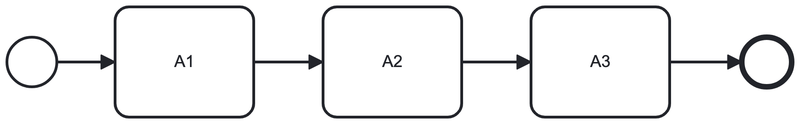</img>

> Primjer predloška WCP-1: Slijed između dvije aktivnosti

Ipak, treba podsjetiti na to kako aktivnosti modelirati kada ih izvode različiti sudionici, u različitim poljima. Koristimo `Message Flow` za komunikaciju između polja te odgovarajuće **međudogađaje**:

</img>

> Primjer predloška WCP-1: Slijed između dvije aktivnosti u različitim poljima

### WCP-2 Paralelno dijeljenje (eng. Parallel Split)

Nakon neke aktivnosti, proces se dijeli u više paralelnih grana. To znači da nakon završetka `A1` mogu započeti aktivnosti `A2` i `A3` i `A4` te se obavljati istodobno, a iza svake od njih može slijediti neka druga aktivnost.

**Mogući početak istovremene aktivnosti ne implicira njihov istovremeni završetak!**

Od jedne značke (_eng. token_) koja ulazi u paralelnu skretnicu `S1`, uvijek se stvara (bez provjere uvjeta) onoliko kopija koliko ima izlaznih grana i svaka od tih kopija značke dalje se kreće po jednoj od paralelnih grana.

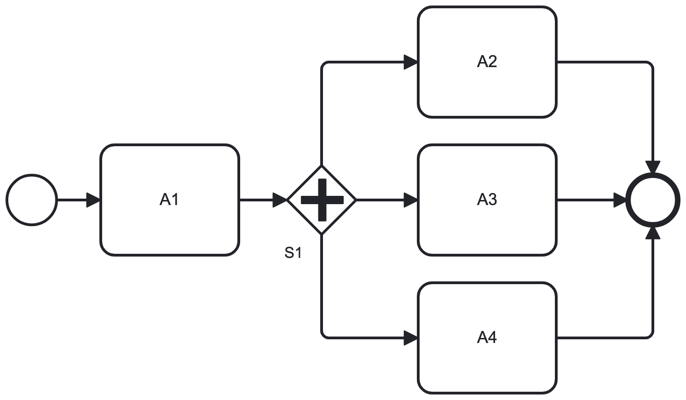</img>

> Primjer predloška WCP-2: Paralelno dijeljenje

### WCP-3 Sinkronizacija (eng. Synchronization)

Neka aktivnost može početi ako su prije nje završene aktivnosti na svim paralelnim granama (mogu biti dvije ili više). To znači da aktivnost `A5` može započeti tek nakon što su završene aktivnosti `A2`, `A3` i `A4`. U **paralelnoj skretnici spajanja S2** (_eng. AND Merge_) sve se ulazne značke uvijek spajaju, bez provjere uvjeta, **u jednu izlaznu**.

</img>

> Primjer predloška WCP-3: Sinkronizacija

### WCP-4 Ekskluzivni izbor (eng. Exclusive Choice)

Nakon neke aktivnosti proces će se nastaviti **samo u jednoj** od više mogućih grana. To znači da će nakon `A1` biti izvedena aktivnost `A2` ili `A3` ili `A4` (odnosno slijed kojem su one na početku). Značka koja ulazi u ekskluzivnu XOR skretnicu `S1` ne dijeli se, već nastavlja jednim od putova koji udovoljava uvjetu što se ispituje prije te skretnice.

</img>

> Primjer predloška WCP-4: Ekskluzivni izbor

### WCP-5 Jednostavno spajanje (eng. Simple Merge)

Neka aktivnost može početi čim je izvedena neka od aktivnosti koje su se izvodile u dva ili više paralelnih sljedova. To znači da aktivnost `A5` može započeti kad završe ili `A2` ili `A3` ili `A4` (odnosno slijed kojem su one bile na kraju).. Aktivnost `A5` će pokrenuti ona značka koju je ekskluzivna skretnica `S1` uputila na neki od sljedova, a koje je prošla kroz ekskluzivnu skretnicu spajanja `S2`.

</img>

> Primjer predloška WCP-5: Jednostavno spajanje

## 2.2 Predlošci za grananje, sinkronizaciju i iteraciju

U ovoj grupi su predlošci koji se koriste za grananje i sinkronizaciju toka izvođenja aktivnosti. Uobičajeno se koriste u situacijama kada je potrebno izvršiti nekoliko aktivnosti istovremeno ili kada se proces nastavlja samo ako su završene sve aktivnosti koje su se izvodile u paralelnim granama.

### WCP-6 Višestruki izbor (eng. Multiple Choice)

Nakon neke aktivnosti proces se može nastaviti u jednoj, dvjema ili u više mogućih grana, **ali najmanje u jednoj**. To znači da poslije `A1` može biti izvedena bilo koja aktivnost, ili bilo koje dvije aktivnosti ili sve tri aktivnosti od mogućih `A2`, `A3` i `A4`.

</img>

> Primjer predloška WCP-6: Višestruki izbor

### WCP-7 Strukturno sinkronizirano spajanje (eng. Structured Synchronizing Merge)

Neka aktivnost može početi ako su izvedene sve aktivnosti koje su se izvodile u dvama ili u više paralelnih sljedova stvorenih ranije u procesu. To znači da `A5` može započeti kad je završila jedna ili više aktivnosti od mogućih `A2`, `A3` i `A4` koje su pokrenule kopije značaka stvorene u inkluzivnoj skretnici grananja (`S1`). Drugim riječima, u `S2` se sinkroniziraju (ili spajaju) kopije onih značaka koje su prije toga stvorene u `S1`. Bez obzira na to koliko je kopija značaka ušlo u izlaznu skretnicu `S2`, izaći će samo jedna.

U poslovnom smislu to znači da će se procesna instanca, koja je obrađena u `A1`, moći obraditi u `A5` nakon što je provedena barem jedna ili više aktivnosti iz skupa `A2`, `A3` i `A4`.

</img>

> Primjer predloška WCP-7: Strukturno sinkronizirano spajanje

### WCP-8 Nesimetrično sinkronizirano spajanje (eng. Acyclic Synchronizing Merge)

Neka aktivnost može početi ako su izvedene sve aktivnosti na dva ili više paralelnih sljedova, stvorenih ranije u procesu na inkluzivnoj skretnici `S1` ali se odluka o tome što treba spajati odnosi na temelju **međudogađaja** koji prethode ekskluzivnoj skretnici spajanja `S2`.

**Nesimetrično spajanje** riješeno je kombinacijom inkluzivne skretnice `S1` (koja će stvoriti jednu, dvije ili tri značke na bilo kojem od tri slijeda) te uvjetovanih događaja na sva tri slijeda ispred konvergentne ekskluzivne skretnice `S2`. Ti će uvjetovani događaji dopustiti izvođenje aktivnosti POKRENUTI MARKETINŠKE AKCIJE kad završe one od prethodnih aktivnosti koje se moraju uskladiti.

</img>

> Primjer predloška WCP-8 na primjeru procesa organizacije marketinške kampanje: Nesimetrično sinkronizirano spajanje

Izvođenje aktivnosti u složenom poslovnom procesu slično je izvođenju procedura u složenom programu. Simboli BPMN-a omogućuju prikaz takvih struktura kao što su `GOTO`, `WHILE...DO`, `REPEAT...UNTIL` u programiranju.

Međutim, u poslovnoj praksi česte su i druge strukture, nepoznate u strukturnom programiranju, koje opisuju ponavljanje odnosno **iteracije** pojedinačne aktivnosti ili grupe aktivnosti.

### WCP-9 Proizvoljno ponavljanje (eng. Arbitrary Cycles)

Ovaj predložak opisuje točku u procesu nakon koje se može ponoviti jedna ili više aktivnosti. Općenito, unaprijed se ne zna treba li uopće nešto ponavljati i ako treba - koliko puta, već je to specifično za svaku instancu procesa pa se stoga to naziva još i **nestrukturiranom petljom**.

Tipičan primjer za ovaj predložak može se pronaći u zdravstvu, a prikazan je na sljedećem primjeru:

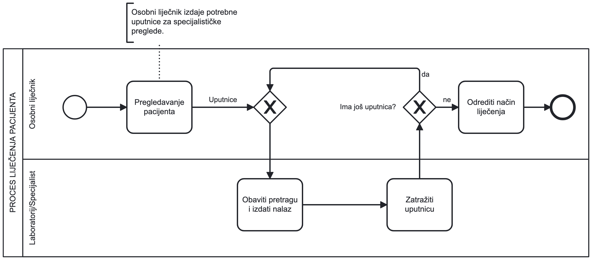</img>

> Primjer predloška WCP-9: Proizvoljno ponavljanje

Primarna zdravstvena zaštita kod nas funkcionira tako da pacijent najprije odlazi na pregled svom osobnom liječniku. Osobni liječnik nakon pregleda odlučuje koje su dodatne pretrage potrebne te za njih izdaje uputnice. Laboratorij ili specijalist će "Obaviti pretragu i izdati nalaz" te zadržati uputnicu (radi obračuna usluge), a pacijent (ako ima još uputnica) će otići na sljedeću pretragu. Osobni će liječnik "Odrediti način liječenja" na temelju nalaza u provedenim pretragama. Općenito se ne zna koliko laboratorijskih pretraga treba napraviti, već će se napraviti onoliko pretraga koliko je potrebno točno određenom pacijentu i primjerenoj njegovoj bolesti.

Ovo je zanimljiv primjer proizvoljnog ponavljanja gdje XOR skretnica spajanja **prethodi** XOR skretnici grananja.

## 2.3 Predlošci za okidače

U ovom potpoglavlju prikazat ćemo nekoliko predložaka koji se koriste za modeliranje okidača u poslovnim procesima. **Okidači** su događaji koji pokreću izvođenje procesa, a mogu biti izazvani **vremenski**, **porukom** ili **signalom**.

### WCP-10 Prolazni okidač (eng. Transient Trigger)

Predložak opisuje proces u kojem izvođenje jedne aktivnosti ovisi o nekom vanjskom poticaju ili drugom procesu (odnosno, vanjski poticaj "okida" aktivnost).

Okidač koji to omogućuje zovemo prolaznim jer nestaje ako u osnovnom procesu već ne čeka instanca koja bi se mogla pokrenuti. Prolazni okidač zapravo je običan prijamni međudogađaj (npr. `Message Intermediate Catch Event`) koji se koristi za hvatanje signala ili poruka od drugih procesa.

Primjer opisuje rad noćnog čuvara u nadziranom objektu. Čuvar će se poslije dolaska (u 20 sati) smjestiti u kontrolnu sobu i "Uključiti nadzorni sustav" koji se sastoji od kamera i senzora kretanja. Ako senzor registrira pokret u objektu, on će "Poslati signal" u kontrolnu sobu. Ako je čuvar u sobi, on će "Provjeriti ishodište alarma". Ako pak čuvara nema, poslani signal neće biti iskorišten i propast će (zato ga zovemo prolaznim).

</img>

> Primjer predloška WCP-10: Prolazni okidač

### WCP-11 Stalni okidač (eng. Persistent Trigger)

Izvođenje aktivnosti u ovom predlošku također ovisi o nekom vanjskom poticaju ili drugom poslovnom procesu (vanjski poticaj okida aktivnost). Okidač djeluje stalno i aktivan je sve dok na njega dolaze instance procesa, a modelira se također kao prijamni događaj (npr. `Message Intermediate Catch Event`) u osnovnom procesu.

Ishodište iz kojeg dolazi poticaj i ovdje se modelira kao predajni međudogađaj (npr. `Message Intermediate Throw Event`) koji šalje ciljanu obavijest određenom okidaču.

Stalni okidač djeluje slično kao prolazni, a **razlika je u tome što se vanjski poticaj ne gubi ako u osnovnom procesu trenutno nema instance koja bi na njega čekala**. Sljedeći primjer pokazuje izradu prozora. Prozor se izrađuje u tri faze: a) prozorski okvir od drva ili profilirane plastike, b) izolacijska kutija od dvije ili tri staklene ploče između kojih je inertni plin, a razmak održavaju letvice s brtvom i c) ugradnja izolacijske kutije u pripremljeni prozorski okvir.

Zbog različitih tehnologija u fazama a) i b) ti se poslovi organiziraju u dvije radionice. Prvi ćemo odjel nazvati IZRADA I MONTAŽA PROIZVODA, a drugi je staklarska radionica IZRADA IZOLACIJSKE KUTIJE. Ovdje smatramo da prvi odjel vodi posao (među kojima su kontakti s kupcima), a drugi da je kooperant (_outsourced_).

Budući da prvi odjel primi narudžbu, on će "Izraditi nacrt proizvoda" i kopiju poslati staklarskoj radionici te nastaviti s aktivnošću "Izraditi prozorski okvir". Staklarska će radionica prema nacrtu "Izraditi izolacijsku kutiju" i poslati je vodećem odjelu koji, nakon primitka gotove izolacijske kutije, može "Ugraditi izo-kutiju u okvir". Dakle, prijamni događaj "Primljena izolacijska kutija" **okidač** je za ovu aktivnosti. Upravo se u ovom detalju vidi bitna razlika između prolaznog i stalnog okidača: vanjski poticaj (ovdje je to tok "Gotova izolacija kutija") neće se izgubiti ako u okidaču "Primljena izolacijska kutija" još nema odgovarajuće instance procesa (odnosno gotovoga prozorskog okvira) već će se iskoristiti (ovdje to znači ugraditi) kad naiđe ta instanca (odnosno kad prozorski okvir bude gotov).

Analizom modela može se utvrditi da su u procesu zapravo **dva stalna okidača**.

Prvi smo već naveli i on je modeliran eksplicitno. Međutim, drugi okidač modeliran je implicitno i određen svojstvom prijamne aktivnosti "Izraditi ukupni račun za prozor". U tu aktivnost ulazi poruka (entitet) - "Račun za staklarske radove" iz emitirajućeg međudogađaja "Poslan račun za staklarske radove" i pokreće se ("okida") njezino izvođenje.

</img>

> Primjer predloška WCP-11: Stalni okidač
