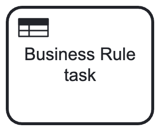

# Upravljanje poslovnim procesima (UPP)

**Nositelj**: izv. prof. dr. sc. Darko Etinger  
**Asistent**: Luka Blašković, mag. inf.

**Ustanova**: Sveučilište Jurja Dobrile u Puli, Fakultet informatike u Puli

</img>

# (5) Decision Model and Notation (DMN)

</img>

 

DMN je formalni standard za modeliranje poslovnih odluka unutar informacijskih sustava i poslovnih procesa. Razvija ga i održava Object Management Group (OMG) kao i BPMN standard koji smo do sada učili na vježbama. DMN omogućuje strukturirano definiranje poslovnih pravila i logike odlučivanja kroz tablice odluka i Friendly Enough Expression Language (FEEL). Korištenjem DMN-a, poslovne organizacije mogu jasno i nedvosmisleno definirati kako se odluke donose, povećavajući transparentnost, dosljednost i mogućnost automatizacije odluka unutar poslovnih procesa razvojem poslovnih aplikacija baziranih na procesno-orijentirano razvoju. DMN se često koristi u kombinaciji s BPMN-om kako bi se odvojila logika odlučivanja od samog toka poslovnog procesa, čime se postiže veća preglednost i održivost modela. Mi ćemo DMN koristiti u kombinaciji s BPMN-om na Camunda platformi za kvalitetnije modeliranje poslovnih procesa.

 

**🆙 Posljednje ažurirano: 30.12.2025.**

## Sadržaj

- [Upravljanje poslovnim procesima (UPP)](#upravljanje-poslovnim-procesima-upp)
- [(5) Decision Model and Notation (DMN)](#5-decision-model-and-notation-dmn)
  - [Sadržaj](#sadržaj)
- [1. Uvod u DMN](#1-uvod-u-dmn)
  - [2. Osnovni koncepti DMN-a](#2-osnovni-koncepti-dmn-a)
  - [2.1 Kombiniranje više ulaznih uvjeta](#21-kombiniranje-više-ulaznih-uvjeta)
  - [2.2 Friendly Enough Expression Language (FEEL)](#22-friendly-enough-expression-language-feel)
    - [FEEL: Tablica usporednih i logičkih operatora](#feel-tablica-usporednih-i-logičkih-operatora)
    - [FEEL: Tablica aritmetičkih i string operatora](#feel-tablica-aritmetičkih-i-string-operatora)
    - [FEEL: Rasponi, liste i posebni FEEL operatori](#feel-rasponi-liste-i-posebni-feel-operatori)
- [3. Kako integrirati DMN s BPMN-om?](#3-kako-integrirati-dmn-s-bpmn-om)
  - [3.1 Poslovno pravilo (Business Rule Task)](#31-poslovno-pravilo-business-rule-task)
- [4. Politike odlučivanja (Hit Policies)](#4-politike-odlučivanja-hit-policies)
  - [4.1 Hit Policy: Unique (Jedinstveni)](#41-hit-policy-unique-jedinstveni)
  - [4.2 Hit Policy: Priority (Prioritetni)](#42-hit-policy-priority-prioritetni)
  - [4.3 Hit Policy: First (Prvi)](#43-hit-policy-first-prvi)
  - [4.4 Hit Policy: Collect (Prikupljanje)](#44-hit-policy-collect-prikupljanje)
  - [4.5 Integracija više DMN tablica u BPMN model](#45-integracija-više-dmn-tablica-u-bpmn-model)
- [Zadaci za Vježbu 5](#zadaci-za-vježbu-5)

# 1. Uvod u DMN

**Decision Model and Notation** (DMN) je formalni standard koji također razvija [Object Management Group (OMG)](https://www.omg.org/dmn/), a namijenjen je modeliranju, dokumentiranju i specificiranju poslovnih odluka unutar informacijskih sustava i poslovnih procesa. DMN je široko prihvaćen u industrijskoj praksi zbog svoje sposobnosti da na jasan, strukturiran i nedvosmislen način definira poslovna pravila i logiku donošenja odluka (_eng. decision-making_). Time se značajno povećavaju transparentnost, dosljednost i mogućnost automatizacije odluka u sklopu poslovnih procesa.

DMN omogućuje učinkovitu suradnju između poslovnih analitičara, domen­skih stručnjaka i razvojnih timova kroz upotrebu standardiziranog notacijskog i izražajnog jezika koji je razumljiv i tehničkim i netehničkim sudionicima. Na sličan način kao što BPMN služi za modeliranje tijeka poslovnih procesa, DMN se fokusira na modeliranje same logike odlučivanja, čime se postiže jasna razdvojenost između procesa i odluka te olakšava njihovo održavanje, promjene i ponovno korištenje.

</img>

> Slika 1. DMN (Decision Model and Notation) logotip

DMN je dizajniran da bude interoperabilan s drugim standardima, posebno s BPMN-om, omogućujući integraciju modela odluka unutar šireg konteksta poslovnih procesa. Ova interoperabilnost omogućuje organizacijama da učinkovito upravljaju složenim poslovnim scenarijima gdje odluke igraju ključnu ulogu u definiranju toka rada i ishoda procesa.

Mi ćemo **DMN koristiti u kombinaciji s BPMN-om** kako bismo transformirali **one poslovne odluke i pravila koja su složenija i zahtjevnija za modeliranje unutar samog BPMN** modela poslovnog procesa - samim time, naš BPMN model će biti pregledniji i jednostavniji za razumijevanje, a poslovna logika egzaktno definirana unutar DMN modela.

## 2. Osnovni koncepti DMN-a

Osnovni koncepti DMN-a uključuju:

- **Tablica odluke (_eng. Decision Table_):** Tablica odluke je ključni element DMN-a koji omogućuje strukturirano definiranje poslovnih pravila i logike odlučivanja. Tablice odluka sastoje se od uvjeta (_input entries_) i rezultata (_output entries_), gdje se na temelju određenih ulaznih podataka donose odluke koje su jasno specificirane u tablici. Ove tablice su lako razumljive i omogućuju brzo prilagođavanje poslovnih pravila bez potrebe za dubokim tehničkim znanjem programiranja.

- **Friendly enough expression language (_FEEL_)**: FEEL je jezik izraza koji se koristi unutar DMN-a za definiranje uvjeta i logike u tablicama odluka. FEEL je dizajniran da bude jednostavan za razumijevanje i korištenje, omogućujući poslovnim korisnicima da izraze složene logičke uvjete na način koji je intuitivan i lako čitljiv.

- **Decision Requirements Diagram (_DRD_)**: DRD je vizualni prikaz koji ilustrira odnose između različitih odluka, ulaza i izvora podataka unutar DMN modela. DRD se koristi kada se modelira složenija poslovna logika odlučivanja koja se ne može jednostavno predstaviti tablicom odluke. **Nećemo ga prolaziti u ovoj skripti**.

Pogledajmo sljedeći jednostavni primjer tablice odluke u DMN-u:

</img>

> Slika 2. DMN tablica odluke "Dish": Odabir jela na temelju uvjeta `Godišnje doba`

Pretpostavimo da smo pozvali nekoliko gostiju na večeru. Pitanje je koje jelo ćemo pripremiti. Na ovom ilustrativnom primjeru slijedimo vrlo jednostavnu logiku odlučivanja tj. odabira - **ovisno o trenutnom godišnjem dobu, odlučit ćemo se za pripremu određenog jela**.

- drugim riječima, ako je jesen, pripremit ćemo gulaš od junetine; ako je zima, pripremit ćemo sarme; ako je proljeće, pripremit ćemo lasagne; a ako je ljeto, pripremit ćemo piletinu na žaru.

Pogledajmo osnovne elemente DMN tablice odluke na ovom primjeru:

- **Naziv odluke** (_eng. Decision Name_): U gornjem lijevom kutu tablici nalazi se **naziv odluke**, koji u ovom slučaju glasi samo "Dish". Ovaj naziv mora jasno opisivati odluku koja se donosi.
- **Politika odlučivanja** (_eng. Hit Policy_): Pored naziva odluke nalazi se **politika odlučivanja** ove tablice odluke. _Hit policy_ definira kako se obrađuju **višestruki rezultati koji mogu proizaći iz tablice odluke**. U našem slučaju, politika odlučivanja je _Unique_ (jedinstvena), što znači da ako se tablica evaluira, **smije postojati najviše jedan "pogođeni" redak**. Ako su pogođena dva ili nijedan, tablica je neispravna za taj ulaz.
  Više o hit policyju u poglavlju 4.

> Napomena: _Hit policy_ ne sprječava loše ili kontradiktorne ulazne vrijednosti, već samo definira što se događa ako više redaka zadovoljava uvjete. Na nama je da osigurano da su ulazne vrijednosti i definirani uvjeti međusobno isključivi kako bismo izbjegli takve situacije - navedeno vrijedi prvenstveno za _unique hit policy_.

- **Ulazni uvjet** (_eng. Input Condition_): Prvi stupac tablice predstavlja ulazni uvjet. U našem slučaju, ulazni uvjet je `Godišnje doba`. Redovi u ovom stupcu definiraju moguće vrijednosti za ovaj ulazni uvjet: "Jesen", "Zima", "Proljeće" i "Ljeto". Ove redove nazivamo **Ulaznim vrijednostima (_eng. Input Entries_)**. Definirani su pod navodnim znakovima jer su to tekstualne vrijednosti (`string`). Ispred prvog uvjeta možete uočiti ključnu riječ `When`, koja označava da se radi o prvom ulaznom uvjetu.

- **Izlazni rezultat** (_eng. Output Result_): Za svaku ulaznu vrijednost (u stupcu ulaznog uvjeta), postoji odgovarajuća vrijednost u drugom stupcu tablice, koji predstavlja izlazni rezultat. U našem slučaju, izlazni rezultat je `Jelo`. Na ovaj način je definirano koje jelo će se pripremiti za svako godišnje doba. Ponovno koristimo navodne znakove budući da su to znakovni nizovi. Primjerice, ako je ulazna vrijednost "Jesen", izlazni rezultat je "Gulaš od junetine". Uočite da se ispred drugog izlaznog rezultata nalazi ključna riječ `Then`.

- **Pravilo odlučivanja** (_eng. Decision rule_): Svaki redak tablice predstavlja jedno pravilo odlučivanja ili **poslovni slučaj**. Na primjer, prvi redak tablice definira pravilo odlučivanja: "Ako je godišnje doba "Jesen", tada pripremi "Gulaš od junetine".

> Zapamtite: Osnovni elementi DMN tablice odluke su: **Naziv odluke** (eng. Decision Name), **Politika odlučivanja** (eng. Hit Policy), **Ulazni uvjeti** (eng. Input Conditions), **Izlazni rezultati** (eng. Output Results) i **Pravila odlučivanja** (eng. Decision Rules).

## 2.1 Kombiniranje više ulaznih uvjeta

Ipak, u stvarnim scenarijima odlučivanja, vrlo često je potrebno uzeti u obzir više ulaznih uvjeta kako bi se donijela ispravna odluka. **DMN tablice odluka omogućuju definiranje više ulaznih uvjeta**. Primjerice, osim godišnjeg doba, možemo uzeti u obzir i jesu li naši gosti vegetarijanci. Radi pojednostavljenja, pretpostavimo da imamo samo dva stanja za ovaj uvjet: _true_ (svi gosti su vegetarijanci) i _false_ (nitko nije vegetarijanac).

> Napomena: Ispravna logička negacija tvrdnje "svi gosti su vegetarijanci" je "postoji barem jedan gost koji nije vegetarijanac". Međutim, za potrebe ovog primjera koristit ćemo jednostavniju formulaciju.

Dakle, gostima koji su vegetarijanci, bez obzira na godišnje doba, ne možemo poslužiti jela koja sadrže meso - a sva naša prethodna jela sadrže meso.

Prema tome, dodat ćemo novi **ulazni uvjet** u našu DMN tablicu odluke, koji će se zvati "All Vegetarian" (ako su svi vegetarijanci). Ovaj uvjet će imati dvije moguće **ulazne vrijednosti**: _true_ i _false_. Uočite da se ispred novog ulaznog uvjeta nalazi ključna riječ `And`, koja označava da se radi o dodatnom ulaznom uvjetu.

**Novi ulazni uvjet** možemo dodati pritiskom na znak `+` koji se nalazi na vrhu stupca naslova ulaznog uvjeta (prikazano zelenom strelicom na slici ispod), dok **novi izlazni rezultat** možemo dodati pritiskom na znak `+` koji se nalazi na vrhu stupca naslova izlaznog rezultata (prikazano crvenom strelicom na slici ispod).

</img>

> Slika 3. DMN tablica odluke "Dish": Zelena strelica prikazuje `+` za dodavanje novog ulaznog uvjeta; crvena strelica prikazuje `+` za dodavanje novog izlaznog rezultata. **Izlazni rezultati uvijek se dodaju nakon svih ulaznih uvjeta**.

Dodat ćemo novi ulazni uvjet: `All Vegetarian` (i ako su svi vegetarijanci) i promijenit ćemo tip ulazne vrijednosti u `boolean`.

> Napomena: Dodavanjem drugog uvjeta, **automatski će se dodijeliti logički operator `AND` između dva uvjeta**. To znači da oba uvjeta moraju biti zadovoljena da bi se odabrao određeni redak iz stupca izlaznih rezultata.

</img>

> Slika 4. DMN tablica odluke "Dish": Definiranje novog ulaznog uvjeta `All Vegetarian` tipa `boolean`

Općenito, Camunda 8 podržava sljedeće tipove podataka za ulazne uvjete u DMN tablicama odluka:

- `string` (znakovni nizovi): npr. "Jesen", "Zima", "odobreno", "Premium korisnik"
- `number` (brojevi): npr. 42, 3.14, -7, -250
- `boolean` (logičke vrijednosti: true/false): npr. _true_, _false_ (bez navodnih znakova)
- `date` (datumi): ISO 8601 format, npr. date("2023-10-15") za 15. listopada 2023.
- `time` (vrijeme): 24-satni format, npr. time("14:30:00") za 14:30 sati
- `dateTime` (datum i vrijeme), ISO 8601 format, npr. dateTime("2023-10-15T14:30:00") za 15. listopada 2023. u 14:30 sati
- `dayTimeDuration` (trajanje dana i vremena), ISO 8601 format, npr. dayTimeDuration("P1DT4H30M") za trajanje od 1 dan, 4 sata i 30 minuta
- `yearMonthDuration` (trajanje godine i mjeseca), ISO 8601 format, npr. yearMonthDuration("P2Y3M") za trajanje od 2 godine i 3 mjeseca

---

Kako sada ispuniti stupac ulaznih vrijednosti za novi ulazni uvjet `All Vegetarian`? **Bez obzira na `Godišnje doba`, ako su svi gosti vegetarijanci, ne možemo im poslužiti jela koja sadrže meso**. Ali, recimo da imamo i **peto jelo** - "Povrće na žaru". Ovo jelo je prikladno za vegetarijance i možemo ga poslužiti bez obzira na `Godišnje doba`, **pod uvjetom da su svi gosti vegetarijanci**.

Moramo osigurati da se prva četiri poslovna pravila (redci u tablici) evaluiraju u _false_ kada je ulazni uvjet `All Vegetarian` postavljen na _false_, dok se peto poslovno pravilo (redak u tablici) evaluira u _true_ kada je ulazni uvjet `All Vegetarian` postavljen na _true_, **neovisno o godišnjem dobu** (ulazni uvjet `Godišnje doba` za 5. redak postavljamo na `"-"` što znači "bilo koja vrijednost").

> **Zapamti**: Oznaka `"-"` (crtica) u DMN tablici odluke označava "bilo koju vrijednost" za taj ulazni uvjet. To znači da se pravilo odnosi na sve moguće vrijednosti tog uvjeta, bez obzira na to što je uneseno.

</img>

> Slika 5. DMN tablica odluke "Dish": Odabir jela na temelju uvjeta `Godišnje doba` i `All Vegetarian`

Kombiniranjem dvaju ulaznih uvjeta (`Godišnje doba` i `All Vegetarian`) osigurali smo da se jela koja sadrže meso ne poslužuju vegetarijancima, dok je jelo "Povrće na žaru" dostupno svim gostima koji su vegetarijanci, bez obzira na `Godišnje doba`.

Dakle, naša pravila odlučivanja sada glase:

- Ako je `Godišnje doba` "Jesen" i nitko nije vegetarijanac (_false_), poslužujemo "Gulaš od junetine".
- Ako je `Godišnje doba` "Zima" i nitko nije vegetarijanac (_false_), poslužujemo "Sarme".
- Ako je `Godišnje doba` "Proljeće" i nitko nije vegetarijanac (_false_), poslužujemo "Lasagne".
- Ako je `Godišnje doba` "Ljeto" i nitko nije vegetarijanac (_false_), poslužujemo "Piletinu na žaru".
- Ako su svi gosti vegetarijanci (_true_), bez obzira koje je `Godišnje doba`, poslužujemo "Povrće na žaru".

## 2.2 Friendly Enough Expression Language (FEEL)

Sada kada smo prošli osnovnu strukturu DMN tablice odluke, pogledat ćemo kako možemo koristiti **Friendly Enough Expression Language (FEEL)** za definiranje ulaznih vrijednosti u našoj tablici odluke. Do sada smo jednostavno uspoređivali ulazne uvjete s određenim vrijednostima (`Godišnje doba` je "Jesen", "Zima", itd., a jesu li svi gosti vegetarijanci je _true_ ili _false_). Međutim, FEEL nam omogućuje izražavanje složenijih uvjeta i logike unutar tablice odluke.

FEEL je specificiran u DMN standardu i dizajniran je da bude jednostavan za razumijevanje i korištenje, čak i za poslovne korisnike koji nisu nužno tehnički stručnjaci. Detljana dokumentacija dostupna [ovdje](https://docs.camunda.io/docs/components/modeler/feel/what-is-feel/).

FEEL podržava sintaksu za izražavanje različitih logičkih uvjeta prema kojima će se naši ulazni podaci evaluirati.

Krenimo jednostavno. Recimo da želimo umjesto uvjeta `Svi vegetarijanci` definirati uvjet `How Many Guests`. Ovaj uvjet će biti tipa `number`, a mi ćemo ćemo osmisliti neki prag. Naravno, budući da imamo 2 uvjeta, kod definicije poslovnih slučajeva **moramo paziti da kombiniramo oba uvjeta**.

Na primjer, sada možemo modelirati sljedeće složenije poslovne slučajeve:

1. Ako je `Godišnje doba` "Jesen" i `How Many Guests` je manji ili jednak 8, poslužit ćemo "Gulaš od junetine".
2. Ako je zima i `How Many Guests` je manji ili jednak 8, poslužit ćemo "Sarme".
3. Ako je proljeće i `How Many Guests` je manji ili jednak 4, poslužit ćemo "Lasagne".
4. Ako je proljeće i `How Many Guests` je između 5 i 8 (uključivo), poslužit ćemo "Piletinu na žaru".
5. Ako je jesen, proljeće ili zima, i očekujemo više od 8 gostiju, pripremat ćemo "Roštilj".
6. Ako je ljeto, bez obzira na `How Many Guests`, poslužit ćemo "Piletinu na žaru".

Obrišite stupac `All Vegetarian` i zamijenite ga sa stupcem `How Many Guests` tipa `number`.

U nastavku ćemo definirati ulazne vrijednosti kao FEEL izraze koji će odgovarati gore navedenim poslovnim slučajevima.

Izraze, na temelju odabranog tipa podataka, možemo unijeti na dva načina:

1. **Direktno u ćeliju**: Jednostavno kliknite na ćeliju unutar stupca ulaznih vrijednosti i upišite FEEL izraz. Na primjer, za prvi redak možemo upisati `<= 8` (manje ili jednako 8).
2. **Kroz mali uređivač izraza**: Kliknite na ikonu olovke koja se pojavljuje kada odaberete ćeliju. Ovo će otvoriti mali uređivač izraza gdje možete unijeti FEEL izraz s dodatnim pomoćnim alatima.

</img>

> Slika 6. DMN tablica odluke "Dish": Feel izraze možemo jednostavno upisati u ćelije stupca ulaznih vrijednosti direktno (crvena strelica) ili kroz mali uređivač izraza (zelena strelica)

U nastavku se nalaze najčešće korišteni FEEL operatori koje možemo koristiti za definiranje ulaznih vrijednosti u DMN tablicama odluka. Ako ne možete pronaći neki operator, ili vam je potrebno dodatno pojašnjenje, možete se poslužiti odličnom Camundinom dokumentacijom za FEEL [ovdje](https://docs.camunda.io/docs/components/modeler/feel/what-is-feel/).

#### FEEL: Tablica usporednih i logičkih operatora

| Sintaksa | Značenje          | Primjer                        |
| -------- | ----------------- | ------------------------------ |
| `=`      | jednako           | `age = 18`                     |
| `!=`     | nije jednako      | `status != "inactive"`         |
| `<`      | manje od          | `score < 60`                   |
| `<=`     | manje ili jednako | `score <= 100`                 |
| `>`      | veće od           | `salary > 50000`               |
| `>=`     | veće ili jednako  | `experience >= 5`              |
| `and`    | logičko I         | `age >= 18 and citizen = true` |
| `or`     | logičko ILI       | `risk = "high" or score < 40`  |
| `not`    | logička negacija  | `not(active)`                  |

> Napomena: Pripazite s znakom jednakosti `=`. Koristi se jedan znak jednakosti za usporedbu vrijednosti, dvostruki znak jednakosti `==` nije podržan.

#### FEEL: Tablica aritmetičkih i string operatora

| Sintaksa | Značenje                       | Primjer                        |
| -------- | ------------------------------ | ------------------------------ |
| `+`      | zbrajanje / spajanje stringova | `price + tax`, `"Mr. " + name` |
| `-`      | oduzimanje / negacija          | `total - discount`             |
| `*`      | množenje                       | `quantity * unitPrice`         |
| `/`      | dijeljenje                     | `revenue / months`             |
| `**`     | potenciranje                   | `2 ** 3`                       |
| `=`      | jednakost stringova            | `country = "US"`               |
| `!=`     | nejednakost stringova          | `type != "TEMP"`               |

#### FEEL: Rasponi, liste i posebni FEEL operatori

| Sintaksa       | Značenje                        | Primjer                   |
| -------------- | ------------------------------- | ------------------------- |
| `[a..b]`       | uključivi raspon                | `age in [18..65]`         |
| `(a..b)`       | isključivi raspon               | `score in (50..100)`      |
| `in`           | pripadnost rasponu ili listi    | `color in ["red","blue"]` |
| `contains()`   | lista sadrži vrijednost         | `contains(tags, "vip")`   |
| `.`            | pristup svojstvu                | `customer.age`            |
| `[]`           | filtriranje liste               | `orders[amount > 100]`    |
| `< 10`         | unarni test (manje od)          | `< 10`                    |
| `>= 5`         | unarni test (veće ili jednako)  | `>= 5`                    |
| `not("A")`     | sve osim vrijednosti            | `not("A")`                |
| `-`            | wildcard (bilo koja vrijednost) | `-`                       |
| `true / false` | boolean vrijednosti             | `approved = true`         |
| `null`         | nema vrijednosti                | `approvalDate = null`     |

> Unarni test je poseban FEEL izraz koji se koristi za definiranje uvjeta koji se odnose na jednu vrijednost, bez potrebe za eksplicitnim navođenjem varijable ili atributa. Na primjer, izraz `< 10` označava da vrijednost mora biti manja od 10, dok izraz `>= 5` označava da vrijednost mora biti veća ili jednaka 5. Ovi izrazi su korisni kada želimo definirati uvjete koji se primjenjuju izravno na ulazne podatke bez dodatnih referenci.

Sada možemo ažurirati našu DMN tablicu odluke koristeći FEEL izraze za definiranje ulaznih vrijednosti u stupcu "How Many Guests" (Koliko gostiju):

- upisivat ćemo jednostavne FEEL izraze usporedbe kao što su `<= 8`, `> 8`, za provjeru unutar uključivog raspona možemo koristiti `[a..b]`, a za definiranje više vrijednosti možemo jednostavno **ispisati sve vrijednosti i odvojiti ih zarezom** ili koristiti funkciju `in`/`contains()`.

</img>

> Slika 7. DMN tablica odluke "Dish": Odabir jela na temelju uvjeta `Godišnje doba` i `How Many Guests` koristeći FEEL izraze za definiranje ulaznih vrijednosti.

# 3. Kako integrirati DMN s BPMN-om?

Možda se pitate, zašto smo ovo uopće išli modelirati DMN tablicom odluke kada možemo jednostavno prikazati logiku odlučivanja unutar samog BPMN modela poslovnog procesa koristeći skretnice? **Koja nam je uopće korist od DMN-a?**

Idemo pokušati stvari modelirati samo BPMN-om. Definirat ćemo jednostavan BPMN dijagram koji modelira odabir jela na temelju godišnjeg doba i broja gostiju, koristeći XOR skretnice, a pripreme jela ćemo prikazati kao aktivnosti.

U grubo, prvo moramo granati XOR skretnicom na temelju godišnjeg doba. Za svako godišnje doba (osim ljeta), moramo dodati još jednu XOR skretnicu koja će granati na temelju broja gostiju.

</img>

> Slika 8. BPMN dijagram: Priprema hrane na temelju godišnjeg doba i broja gostiju koristeći XOR skretnice

**Uočite nekoliko problema s ovim pristupom:**

- imamo puno grananja za naizgled jednostavnu logiku odlučivanja, što već odmah čini ovaj jednostavan BPMN model **složenijim za razumijevanje**, **održavanjem** i **daljnju nadogradnju**.
- imamo **nepregledno preklapanje strelica** izlaznih sljedova XOR skretnica, a rekli smo da to želimo nastojati izbjegavati kako bismo poboljšali čitljivost BPMN modela.
- imamo **duple BPMN elemente** (ponavljanje XOR skretnice grananja - "Broj gostiju?" tri puta) - opet dodatno komplicira BPMN model koji bi trebao biti jednostavan.

Međutim, nismo još niti dodali 5. uvjet koji će značajno zakomplicirati ovaj BPMN model - "Roštilj ako je više od 8 gostiju i nije ljeto". Idemo vidjeti:

</img>

> Slika 9. BPMN model: Priprema hrane na temelju godišnjeg doba i broja gostiju koristeći XOR skretnice (s dodatnim uvjetom za "Roštilj")

Sada smo dobili još složeniji i nepregledniji BPMN model s dodatnim grananjem i još više preklapanja strelica izlaznih sljedova (za uvjet `How Many Guests` > 8 i `Godišnje doba` nije ljeto).

Zaključujemo da **ovakav pristup modeliranju postaje neodrživ vrlo brzo** - kada se radi o složenijim poslovnim pravilima i odlukama. Uzeli smo najjednostavniji mogući primjer donošenja odluke, a već smo se susreli s problemima čitljivosti i održavanja BPMN modela - zamislite kako bi to izgledalo za stvarne poslovne odluke koje mogu imati na desetke ili stotine pravila i uvjeta koji se međusobno mogu ispreplitati - što ćemo vidjeti u nastavku.

Preporuka je da **složenije poslovne odluke i pravila modeliramo korištenjem DMN tablica odluka**, a zatim ih integriramo unutar BPMN modela poslovnog procesa koristeći aktivnosti **Poslovnih pravila** - više o tome u sljedećem poglavlju.

## 3.1 Poslovno pravilo (Business Rule Task)

**DMN tablice odluka su idealno rješenje za modeliranje složenih poslovnih pravila i odluka unutar BPMN modela poslovnog procesa**. One omogućuju jasnu **separaciju između toka poslovnog procesa i logike odlučivanja**, čineći oba modela preglednijima i lakšima za održavanje.

U BPMN modelu, možemo koristiti **Poslovna pravila** (_eng. Business Rule Task_) - element za integraciju DMN tablice odluke. Radi se o posebnoj vrsti aktivnosti koja je dizajnirana za "pozivanje DMN tablica" odluka unutar BPMN procesa.

  
  <b>Business Task Rule</b> element u BPMN modelu služi za integraciju s DPMN tablicama u svrhu boljeg modeliranja donošenja poslovnih odluka unutar BPMN procesa.

_Business Rule Task_ element, kao i obične aktivnosti, **zahtjevaju neke resurse**. Konkretno, u ovom slučaju, **resursi će biti svi ulazni podaci** koje naša modelirana DMN tablica odluke zahtijeva kako bi mogla donijeti odluku, dok će **izlazni podaci biti rezultat koji tablica odluke vraća** nakon evaluacije i koji se dalje može koristiti unutar BPMN procesa.

> **Zapamtite**: Iako u BPMN dijagramima možemo definirati složene logike odlučivanja kombiniranjem skretnica i drugih elemenata (to smo do sada i radili), korištenje DMN tablica odluka putem _Business Rule Task_ elemenata pruža mnogo **čišći**, **održiviji** i **skalabilniji** pristup za modeliranje poslovnih odluka unutar BPMN procesa koje su složenije prirode. Također, ponekad ne želimo zamarati dionike na koji način se donose određene odluke unutar procesa, već je dovoljno da znaju koje su to odluke i kako one utječu na daljnji tijek procesa. S druge strane, za dionike koji su zaduženi za održavanje poslovnih pravila i odluka, njima možemo prezentirati DMN tablice odluka koje su mnogo preglednije i jednostavnije za razumijevanje i eventualne izmjene, u usporedbi s isprepletenim BPMN sljedovima koji sadrže brojne skretnice grananja i spajanja.

---

Kada bismo naš _Business Task Rule_ sada nazvali "Odaberi jelo" i povezali ga s DMN tablicom odluke koju smo ranije definirali, BPMN model bi izgledao mnogo jednostavnije i preglednije. Rezultat DMN tablice odluke je **podatak koji predstavlja odabrano jelo**, a mi ga možemo koristiti na sljedećoj skretnici prema kojoj ćemo granati daljnji tijek procesa.

Na izlazne sljedove XOR skretnice grananja "Odabrano jelo?" možemo jednostavno **ispisati sve moguće izlazne rezultate iz DMN tablice** odluke ("Gulaš od junetine", "Sarme", "Lasagne", "Piletina na žaru", "Roštilj").

</img>

> Slika 10. BPMN model: Priprema hrane na temelju DMN tablice odluke koristeći _Business Rule Task_ za odabir jela.

Dobili smo puno čitljiviji model poslovnog procesa koji jasno prikazuje tijek procesa bez nepotrebnih detalja o logici odlučivanja. Sada je logika odlučivanja jasno definirana unutar DMN tablice odluke, što olakšava održavanje i prilagodbu poslovnih pravila **bez potrebe za izmjenama BPMN modela**.

Naravno, možemo dodatno smanjiti redundanciju u našem BPMN modelu uklanjanjem XOR skretnice "Odabrano jelo?" i generalizacijom samo jednom aktivnošću; "Priprema jela", sve ovisi koliko detaljno, u koju svrhu i za koje dionike modeliramo BPMN dijagram.

Primjer generaliziranog BPMN modela:

</img>

> Slika 11. BPMN model: Priprema hrane na temelju DMN tablice odluke koristeći _Business Rule Task_ za odabir jela (generalizirana verzija)

> Napomena: U scenarijima prilikom razvoja poslovne aplikacije, moramo povezati naš _Business Rule Task_ s odgovarajućom DMN tablicom odluke unutar Camunda okruženja. Ovo ćemo pokazati na sljedećim vježbama, a za sada je dovoljno da naučimo modelirati DMN tablice odluke.

# 4. Politike odlučivanja (Hit Policies)

U DMN tablicama odluka, politika odlučivanja (_eng. Hit Policy_) određuje **kako se obrađuju višestruki rezultati koji mogu proizaći iz tablice odluke**. Postoji nekoliko različitih politika odlučivanja koje možemo koristiti, ovisno o specifičnim zahtjevima našeg poslovnog scenarija. U nastavku su opisane najčešće korištene politike odlučivanja na primjeru modeliranja **donošenja odluke o uvjetima za odobravanje kredita** (eng. _Loan Approval_).

Detalje možete uvijek pogledati u službenoj Camunda dokumentaciji za DMN tablice odluka [ovdje](https://docs.camunda.io/docs/components/modeler/dmn/decision-table-hit-policy/).

## 4.1 Hit Policy: Unique (Jedinstveni)

_Unique hit policy_ je najčešće korištena politika odlučivanja u DMN tablicama odluka.

Ova politika zahtijeva da **za svaki skup ulaznih podataka postoji najviše jedan odgovarajući redak u tablici odluke**. Odnosno, da za svako poslovno pravilo koje se evaluira, može biti zadovoljen samo jedan redak u tablici odluke.

- ako se evaluacijom tablice odluke pronađu dva ili više redaka koji zadovoljavaju uvjete, tablica je **neispravna za taj ulazni skup podataka**
- ako niti jedno pravilo nije zadovoljeno, tablica **ne daje nikakav rezultat**, ali je ispravna

Ovo je korisno kada modeliramo odluke koje trebaju biti jednoznačne i nedvosmislene, npr. kod problema **klasifikacije** ili **kategorizacije**. Važno je definirati precizne uvjete i **međusobno isključiva pravila** (_eng. Mutually exclusive rules_) kako bi se osigurala jedinstvenost rezultata.

- primjerice, pravila `<=10` i `>=10` nisu međusobno isključiva jer se oba mogu zadovoljiti za vrijednost `10` pa takav slučaj za _Unique_ hit policy nije dopušten.

---

Primjer _Unique hit policy_ DMN tablica: _Determine Loan Eligibility_:

Dobra praksa je prvo u nekoliko natuknica opisati poslovna pravila koja želimo modelirati, slično kao što smo radili na primjeru s odabirom jela. Međutim, prije toga, još je bolje prvo definirati **ulazne uvjete** i **izlazne rezultat/e** DMN tablice odluke.

**Ulazni uvjeti**:

- `Dob` - dob klijenta (tip: `number`)
- `Prihod` - mjesečni prihodi klijenta u eurima (tip: `number`)
- `Kreditni rizik` - ocjena kreditnog rizika klijenta (tip: `string`, moguće vrijednosti: "Nizak", "Srednji", "Visok")
- `Iznos kredita` - traženi iznos kredita u eurima (tip: `number`)

**Izlazni rezultat**:

- `Odluka o kreditu` - odluka o odobrenju kredita (tip: `string`, moguće vrijednosti: "Odobren", "Odbijen")

Dalje, definirat ćemo **poslovna pravila** koja želimo modelirati:

1. Ako je `Dob` klijenta manja od 18 godina, kredit se odbija.
2. Ako je `Dob` klijenta veća ili jednaka 18 godina, a `Prihod` manji od 1000 eura, kredit se odbija.
3. Ako je `Dob` klijenta veća ili jednaka 18 godina, `Prihod` veći ili jednaki 1000 eura, a `Kreditni rizik` je "Visok", kredit se odbija.
4. Ako je `Dob` klijenta veća ili jednaka 18 godina, `Prihod` veći ili jednaki 1000 eura, `Kreditni rizik` je "Srednji", a `Iznos kredita` veći od 20,000 eura, kredit se odbija.
5. Ako je `Dob` klijenta veća ili jednaka 18 godina, `Prihod` veći ili jednaki 1000 eura, `Kreditni rizik` je "Nizak" ili "Srednji", a `Iznos kredita` manji ili jednak 20,000 eura, kredit se odobrava.

Ovu DMN tablicu odluke s _Unique hit policy_ možemo modelirati na sljedeći način:

</img>

> Slika 12. DMN tablica odluke "Determine Loan Eligibility": Određivanje ulaznih uvjeta za odobravanje kredita koristeći _Unique_ hit policy

Budući da neki stupci imaju **predefinirane vrijednosti**, npr. `Kreditni rizik` može biti samo "Nizak", "Srednji" ili "Visok", ili `Odluka o kreditu` može biti samo "Odobren" ili "Odbijen", možemo definirati te stupce kao **enumeracije**, odnosno definirati preddefinirane vrijednosti koje su dopuštene za te stupce.

- jednostavno navodimo vrijednosti u **dvostrukim navodnicima** i **odvajamo ih zarezom**.

</img>

> Slika 13. DMN tablica odluke "Determine Loan Eligibility": Definiranje enumeracija za stupce s preddefiniranim vrijednostima. Enumeracije moramo definirati za stupce `Kreditni rizik` i `Odluka o kreditu`.

Dodat ćemo i preostale tipove podataka/enumeracije za ulazne uvjete i izlazni rezultat:

</img>

> Slika 14. DMN tablica odluke "Determine Loan Eligibility": Definiranje svih tipova podataka za ulazne uvjete i izlazni rezultat

Sada možemo ispuniti ulazne vrijednosti za svaki redak tablice odluke prema definiranim poslovnim pravilima.

</img>

> Slika 15. DMN tablica odluke "Determine Loan Eligibility": Popunjavanje ulaznih vrijednosti prema definiranim poslovnim pravilima

## 4.2 Hit Policy: Priority (Prioritetni)

Kod prioritetnog _hit policya_, možemo imati **više redaka u tablici odluke koji zadovoljavaju uvjete** za određeni skup ulaznih podataka. Međutim, samo će se **jedan rezultat** vratiti na temelju **unaprijed definiranog prioriteta izlaznih vrijednosti** bez obzira na redoslijed zadovoljenih pravila.

Izlazne vrijednosti u tablici odluke moraju biti definirane kao **enumeracije** s jasno definiranim redoslijedom prioriteta. **Prvi navedeni rezultat (enumeracija) ima najviši prioritet, a posljednji najniži prioritet**.

Ovo je korisno kada modeliramo odluke gdje je moguće da više pravila budu zadovoljena, ali želimo osigurati da se uvijek odabere najvažniji ili najrelevantniji rezultat, primjerice kod **kategorizacije rizika** ili **donošenja preporuka na temelju prioriteta**.

---

Primjer _Priority hit policy_ DMN tablica: _Determine Credit Risk_:

Možemo koristiti isti poslovni scenarij za odobravanje kredita; tj. sada ćemo definirati tablicu odluke koristeći _Priority_ hit policy za definiranje ulaznog uvjeta iz prethodnog primjera - `Kreditni rizik` - ocjena kreditnog rizika klijenta (tip: `string`, enumeracije: "High", "Medium", "Low").

Dakle, odmah možemo uočiti prioritet izlaznih vrijednosti: "High" (Visok) ima najviši prioritet, zatim "Medium" (Srednji), a "Low" (Nizak) ima najniži prioritet.

U našem slučaju, ideja je da najgori primjenjivi `Kreditni rizik` **dominira nad boljim kreditnim rizicima**. Na primjer, ako su ispunjeni uvjeti za "High" i "Medium" `Kreditni rizik`, rezultat će biti "High" jer ima viši prioritet. ili ako su ispunjeni uvjeti za "Medium" i "Low", rezultat će biti "Medium".

Ponovo ćemo definirati ulazne uvjete i izlazni rezultat tablice odluke:

**Ulazni uvjeti**:

- `Kreditni rating` - ocjena kreditnog rizika klijenta (tip: `number`) - dodjeljuje ju banka na temelju odrađenog intervjua s klijentom i pregleda njegovih financijskih podataka
- `Debt-to-Income Ratio` - omjer duga i prihoda klijenta (tip: `number`) - izračunava banka na temelju financijskih podataka klijenta

**Izlazni rezultat**:

- `Kreditni rizik` - ocjena kreditnog rizika klijenta (tip: `string`, enumeracije: "High", "Medium", "Low")

Zamislimo da određena financijska institucija procjenjuje kreditni rizik klijenata na temelju sljedećih poslovnih pravila:

1. Ako je `Kreditni rating` manji od 580, `Kreditni rizik` je "High".
2. Ako je `Debt-to-Income Ratio` veći od 0.45, `Kreditni rizik` je "High".
3. Ako je `Kreditni rating` manji od 670, a `Debt-to-Income Ratio` veći od 0.35, `Kreditni rizik` je "Medium".
4. Ako je `Kreditni rating` veći ili jednak 670, a `Debt-to-Income Ratio` manji ili jednak 0.35, `Kreditni rizik` je "Low".

**Važno!** Uočite sljedeću situaciju: Kada je `Kreditni rating` 600 i `Debt-to-Income Ratio` 0.50, oba uvjeta definirana pravilima 2 i 3 su zadovoljena:

Dakle, kada bismo koristili _Unique_ hit policy, tablica odluke bi bila neispravna jer su zadovoljena dva pravila za jedan skup ulaznih podataka. Međutim, s _Priority_ hit _policyjem_, definirali smo da "High" ima viši prioritet od "Medium", pa će izlazni rezultat, odnosno `Kreditni rizik`, biti "High" prema pravilu 2.

Pogledajmo ovu DMN tablicu odluke:

</img>

> Slika 16. DMN tablica odluke "Determine Credit Risk": Određivanje kreditnog rizika koristeći _Priority_ hit policy

**Prioritet** izlaznih vrijednosti definiramo jednostavnim navođenjem vrijednosti u stupcu izlaznog rezultata kao **enumeracije**. Prva navedena vrijednost ima najviši prioritet, a posljednja najniži.

</img>

> Slika 17. DMN tablica odluke "Determine Credit Risk": Definiranje enumeracija za stupac izlaznog rezultata s prioritetnim redoslijedom: "High" > "Medium" > "Low".

## 4.3 Hit Policy: First (Prvi)

Kod _First_ hit policyja, kada se evaluira tablica odluke, **samo se prvi redak koji zadovoljava uvjete koristi za određivanje izlaznog rezultata**. Ostali redci koji također zadovoljavaju uvjete se zanemaruju.

Zašto prvi redak? Zato što se redci u tablici odluke evaluiraju redom, od vrha prema dnu (`1 - n`). Ovo je korisno kada želimo osigurati da se uvijek koristi najvažnije ili najrelevantnije pravilo koje je definirano na vrhu tablice.

Primjeri scenarija gdje je _First hit policy_ koristan uključuju situacije poput **donošenja preporuka** ili **primjene popusta** gdje je važno da se prvo primijene najvažnija pravila definirana prema _top-bottom_ redoslijedu. Važno je zapamtiti sljedeće:

- Ako niti jedan redak ne zadovoljava uvjete, tablica neće vratiti nikakav rezultat.

- Ako više redaka zadovoljava uvjete, koristi se onaj koji je prvi pronađen tijekom evaluacije.

- Posljednje pravilo u tablici je "catch-all" pravilo koje bi trebalo biti zadovoljeno kada nijedno drugo pravilo nije zadovoljeno (npr. korištenjem wildcard operatora `-` ili definirajući uvjete koji pokrivaju sve preostale slučajeve).

---

Primjer: _First hit policy_ DMN tablica: _Determine Interest Rate_:

Recimo da naša financijska institucija želi odrediti kamatnu stopu za klijente na temelju njihovog **kreditnog rizika** i **iznosa kredita** koji traže. Rezultat će se odabrati prema prvom zadovoljenom uvjetu, a posložit ćemo ih prema nekom prioritetu financijske institucije. Npr. banka želi prvo primijeniti najstrože uvjete za određivanje kamatne stope pa ćemo to staviti na vrh DMN tablice odluke. Najpovoljnija kamatna stopa za klijenta bit će na dnu tablice.

**Ulazni uvjeti**:

- `Kreditni rizik` - ocjena kreditnog rizika klijenta (tip: `string`, moguće vrijednosti: "High", "Medium", "Low") - dobili smo ga iz DMN tablice: _Determine Credit Risk_ iz prvog primjera.
- `Iznos kredita` - traženi iznos kredita u eurima (tip: `number`)

**Izlazni rezultat**:

- `Kamatna stopa` - kamatna stopa koja će se primijeniti na kredit (tip: `number`, izražena u postotcima, npr. 5.5 za 5.5%)

Dalje, definirat ćemo poslovna pravila. Za visoki kreditni rizik ne izdajemo kredit (prema tablici odluke s _Unique_ hit _policyjem_) pa ćemo to pravilo izostaviti iz ove tablice odluke:

1. Ako je `Kreditni rizik` "Medium" i `Iznos kredita` veći manji ili jednak 10,000 eura, kamatna stopa je 9.5%.
2. Ako je `Kreditni rizik` "Medium" i `Iznos kredita` veći od 10,000 eura, kamatna stopa je 11.0%.
3. Ako je `Kreditni rizik` "Low", primjenjuje se kamatna stopa od 5.5%. Ovo je "catch-all" pravilo za sve preostale klijente s niskim kreditnim rizikom.

DMN tablicu odluke s _First_ hit policy možemo modelirati na sljedeći način:

</img>

> Slika 18. DMN tablica odluke "Determine Interest Rate": Određivanje kamatne stope koristeći _First hit policy_

## 4.4 Hit Policy: Collect (Prikupljanje)

Kod _Collect hit policyja_, kada se evaluira tablica odluke, **svi redci koji zadovoljavaju uvjete se prikupljaju i njihovi izlazni rezultati se kombiniraju** u jedan rezultat (lista). Ova politika je korisna kada želimo dobiti sve moguće rezultate koji zadovoljavaju uvjete, umjesto da se fokusiramo samo na jedan rezultat.

Osim prikupljanja rezultata, _Collect hit policy_ također omogućuje **agregaciju** tih rezultata na različite načine, ovisno o specifičnim potrebama poslovnog scenarija. Dakle, rezultati izlaznog stupca iz svih zadovoljenih redaka se prikupljaju i **agregiraju na određeni način**, **ovisno o definiranom načinu agregacije** (npr. zbrajanje, prosjek, maksimalna ili minimalna vrijednost). **Tada rezultat nije lista već jedna agregirana vrijednost**.

Prema tome, postoje sljedeće varijante _Collect hit policyja_:

- _Collect (Sum)_ - **zbraja** sve izlazne vrijednosti iz zadovoljenih redaka/pravila
- _Collect (Min)_ - uzima **minimalnu** vrijednost iz zadovoljenih redaka/pravila
- _Collect (Max)_ - uzima **maksimalnu** vrijednost iz zadovoljenih redaka/pravila
- _Collect (Count)_ - **broji** koliko je redaka/pravila zadovoljeno

---

Primjer: Collect (sum) DMN tablica: _Calculate Total Fees_:

Recimo da naša financijska institucija želi izračunati ukupne naknade koje će se primijeniti na kredit na temelju različitih kriterija. Svaki kriterij može dodati određenu naknadu, a **mi želimo zbrojiti sve naknade koje su primjenjive za dani skup ulaznih podataka**.

Prema tome, koristit ćemo varijantu _Collect (Sum)_ hit policyja.

Našu DMN tablicu odluke ćemo modelirati na temelju sljedećih ulaznih uvjeta i izlaznog rezultata.

**Ulazni uvjeti**:

- `Tip kredita` - vrsta kredita koji klijent traži (tip: `string`, moguće vrijednosti: "Gotovinski", "Stambeni", "Auto", "Poslovni")
- `Iznos kredita` - traženi iznos kredita u eurima (tip: `number`)
- `Trajanje kredita` - trajanje kredita u mjesecima (tip: `number`)
- `Potrebno osiguranje` - označava treba li se osigurati otplata kredita (tip: `boolean`, moguće vrijednosti: _true_, _false_)

**Izlazni rezultat**:

- `Naknada` - naknada koja će se primijeniti (tip: `number`, izražena u eurima)

Dalje, definirat ćemo poslovna pravila:

1. Ako je `Tip kredita` `Gotovinski`, dodaje se naknada od 500 eura.
2. Ako je `Tip kredita` `Stambeni` i `Iznos kredita` veći od 50,000.00 eura, dodaje se naknada od 1000 eura.
3. Ako je `Tip kredita` `Auto`, dodaje se naknada od 300 eura.
4. Ako je `Trajanje kredita` veće od 180 mjeseci, dodaje se naknada od 350 eura.
5. Ako je kredit `Gotovinski` i `Potrebno je osiguranje`, dodaje se naknada od 500 eura.
6. Ako je kredit `Auto` i `Potrebno je osiguranje`, dodaje se naknada od 250 eura.
7. Ako je kredit `Stambeni` i nije `Potrebno osiguranje`, dodaje se naknada od 1000 eura.

> Napomena: Kada imamo više pravila u DMN tablicama, nije loše dodati opise poslovnih pravila u posljednjem stupcu tablice (`Annotations`) kako bismo olakšali razumijevanje svrhe svakog pravila.

DMN tablicu odluke s _Collect (Sum) hit policy_ možemo modelirati na sljedeći način:

</img>

> Slika 19. DMN tablica odluke "Calculate Total Fees": Izračun ukupnih naknada koristeći _Collect (Sum) hit policy_

Pogledajmo nekoliko primjera evaluacije ove DMN tablice odluke:

1. Ako smo odobrili stambeni kredit od 150,000.00 eura bez osiguranja i na trajanje od 240 mjeseci, evaluirat će se sljedeća pravila:

- Pravilo 2: Naknada od 1000 eura (stambeni kredit veći od `50,000` eura)
- Pravilo 4: Naknada od 350 eura (trajanje kredita veće od `180` mjeseci)
- Pravilo 7: Naknada od 1000 eura (kredit bez osiguranja)

Ova DMN tablica vraća ukupnu naknadu od 2350 eura. Dakle, to je iznos koji moramo naplatiti klijentu kao ukupnu naknadu za odobreni kredit.

2. Ako smo odobrili gotovinski kredit od 5,000.00 eura s osiguranjem i na trajanje od 12 mjeseci, evaluirat će se sljedeća pravila:

- Pravilo 1: Naknada od 500 eura (gotovinski kredit)
- Pravilo 5: Naknada od 500 eura (gotovinski kredit s osiguranjem)

Ova DMN tablica vraća ukupnu naknadu od 1000 eura. Dakle, to je iznos koji moramo naplatiti klijentu kao ukupnu naknadu za odobreni kredit.

I tako dalje, možemo evaluirati različite scenarije kredita i dobiti ukupne naknade na temelju primjenjivih pravila.

Slično bismo definirali i ostale varijante _Collect hit policyja_ - jedina razlika je u načinu na koji se agregiraju rezultati iz zadovoljenih redaka/pravila.

**Kada ne bismo koristili agregaciju (već samo _Collect hit policy_), rezultat bi bio lista svih izlaznih vrijednosti iz zadovoljenih redaka/pravila** koje onda možemo koristiti dalje u našem poslovnom procesu/aplikaciji.

## 4.5 Integracija više DMN tablica u BPMN model

Napokon, idemo definirati dijagram poslovnog procesa koji koristi sve četiri izrađene DMN tablice odluka u jednom BPMN modelu - uz pomoć _Business Rule Task_ aktivnosti.

U prethodnom poglavlju smo definirali sljedeće DMN tablice odluka:

1. _Determine Loan Eligibility_ (Unique hit policy) - određivanje uvjeta za odobravanje kredita
2. _Determine Credit Risk_ (Priority hit policy) - određivanje kreditnog rizika
3. _Determine Interest Rate_ (First hit policy) - određivanje kamatne stope odobrenog kredita
4. _Calculate Total Fees_ (Collect (Sum) hit policy) - izračun ukupnih naknada odobrenog kredita

Prvo provjeravamo je li klijent donio svu potrebnu dokumentaciju za obradu zahtjeva za kreditom. Ako nije, proces se završava. Ako je dokumentacija kompletna, djelatnik banke započinje s obradom zahtjeva. Djelatnik banke mora donijeti odluku o odobrenju kredita koristeći prvu DMN tablicu odluke. Međutim, kako je prvi korak procjena kreditnog rizika na temelju prihoda, duga i iznosa traženog kredita, **prvo ćemo iskoristiti drugu DMN tablicu** odluke za određivanje samog kreditnog rizika.

Dokumentacija koju klijent mora dostaviti mora uključivati, između ostalog, i **sve ulazne podatke potrebne za uspješnu evaluaciju DMN tablica** odluka (naravno, u praksi su tu i drugi dopunski dokumenti).

Dokumentacija mora uključivati:

- `Dob`
- `Prihode`
- `Iznos traženog kredita`
- `Tip kredita`
- `Željeno trajanje kredita`
- `Potrebno osiguranje - da/ne`

Za drugu DMN tablicu - _Determine Credit Risk_ - potrebni su nam ulazni podaci:

- `Kreditni rating`
- `Debt-to-Income Ratio`

To su podaci koje ne donosi klijent, već ih banka mora **izračunati na temelju trenutnog financijskog stanja klijenta i njegovih financijskih obveza**. Ovo ćemo prikazati kao **zasebnu servisnu aktivnost** u BPMN modelu.

#### Data Store element <!-- omit from toc -->

Ponekad se u BPMN notaciji koristi poseban simbol za označavanje udaljenih (ili internih) sustava/servisa ili baza podataka s kojima poslovni proces komunicira. U Camundi, to je **Data Store** element.

Nakon što smo izračunali `Kreditni rating` i `Debt-to-Income Ratio`, dodajemo _Business Rule Task_ aktivnost koja poziva drugu DMN tablicu odluke - _Determine Credit Risk_ - kako bismo dobili `Kreditni rizik`.

Rezultat ove aktivnosti je `Kreditni rizik`, koji ćemo koristiti kao ulazni podatak za prvu DMN tablicu odluke - _Determine Loan Eligibility_ kako bismo donijeli odluku o odobrenju kredita.

> Uočite sljedeće: Nije potrebno pisati XOR skretnicu te granati na temelju podataka: "High", "Medium", "Low" kreditnog rizika. To je upravo ono što želimo sažeti DMN notacijom - samu logiku odlučivanja. Dakle, samo pozivamo DMN tablicu odluke i koristimo njen rezultat kao novi ulazni podatak za sljedeću DMN tablicu odluke.

</img>

> Slika 20. BPMN model: Određivanje uvjeta za odobravanje kredita koristeći DMN1 i DMN2 tablice odluka i _Business Rule Task_ aktivnosti

Nakon što smo dobili odluku o odobrenju kredita, sljedeće dvije DMN tablice odluka - _Determine Interest Rate_ i _Calculate Total Fees_ - možemo pozvati redom koristeći zasebne _Business Rule Task_ aktivnosti, **ali samo ako je kredit odobren**. Dakle, dodajemo XOR skretnicu za grananje na temelju odluke iz DMN tablice odluke.

Idemo dalje. Pozvati ćemo treću DMN tablicu odluke - _Determine Interest Rate_ - kako bismo odredili kamatnu stopu za odobreni kredit. Rezultat ove aktivnosti je `Kamatna stopa`, koju ćemo koristiti kao ulazni podatak za četvrtu DMN tablicu odluke - _Calculate Total Fees_ - kako bismo izračunali ukupne naknade za odobreni kredit. **Dodat ćemo skretnicu u slučaju da klijent odbije kredit nakon što mu se priopće kamatna stopa ili ukupne naknade**.

U slučaju da klijent prihvati kredit, potpisuje se ugovor o kreditu i kredit se isplaćuje u najkraćem mogućem roku. Tu proces završava.

</img>

> Slika 21. BPMN model: Određivanje uvjeta za odobravanje kredita koristeći sve četiri DMN tablice odluka i _Business Rule Task_ aktivnosti

# Zadaci za Vježbu 5

1. Definirajte DMN tablicu odluke koristeći _Unique hit policy_ za izračunavanje fiksnih **troškova dostave** na temelju `težine paketa` (u kg), `udaljenosti dostave` (u km), `destinacije` (odabir između "Lokalna", "Nacionalna", "Međunarodna") te `vrste dostave` (odabir između "Standardna", "Ekspresna"). Definirajte barem pet poslovnih pravila za izračun troškova dostave. Pazite da jasno definirate međusobno isključiva pravila kako biste osigurali jedinstvenost rezultata.
    
2. Definirajte DMN tablicu odluke koristeći _First hit policy_ za određivanje **vrste dostave**. na temelju `vrijednosti narudžbe` (u eurima) i `željeno maksimalno vrijeme isporuke` (u danima) te `tipa proizvoda` (odabir između "Elektronika", "Odjeća", "Namještaj"). Definirajte barem četiri poslovna pravila za određivanje vrste dostave.
    
3. Definirajte DMN tablicu odluke koristeći _Collect (Sum) hit policy_ za akumulirajući izračun **popusta u postocima** na temelju `tipa/vrste klijenta`, `vrijednosti narudžbe`, `korištenja promo koda` te `broja prethodnih narudžbi`. Definirajte barem pet poslovnih pravila za izračun ukupnih popusta. Popusti se zbrajaju, a svaki uvjet predstavlja neovisnu komponentu popusta.

Jednom kad ste definirali sve tri DMN tablice odluka, integrirajte ih u jedan BPMN model koristeći _Business Rule Task_ aktivnosti za poslovni proces obrade narudžbi i dostave. Modelirajte tijek procesa od primitka narudžbe do njezine isporuke.
